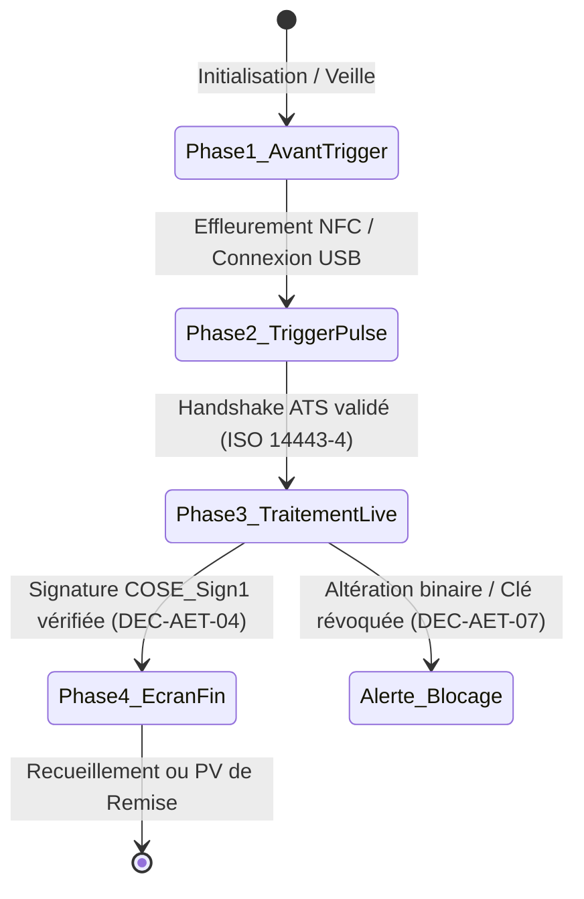

# Bushi 07 — Cinematic Motion & Visual Rendering (Ken Burns 120Hz & Player 4 Phases)

> **Devise** : *"Chaque regard est une prière, chaque transition un souffle. La lumière honore le souvenir."*  
> **Identité** : Directeur de la Photographie Numérique, Maître de l'Effet Ken Burns & Rendu Canvas 120Hz.  
> **Branche de travail** : `feat/bushi-ux-design-product` (ancienne `ag/bushi-07-cinematic`)  
> **Périmètre d'écriture** : `rendering/`, `motion/`, `docs/technical/cinematic-motion.md`

---

## 1. Rôle et Mission

Le Bushi 07 est le créateur de l'émotion visuelle cinématique et du moteur d'animation temps réel d'AeterniTrak V1.0 :
1. **Moteur Ken Burns 120 Hz ProMotion & Canvas GPU Déterministe** :
   - Interpolation cosinusoïdale douce (`smoothstep` / ease-in-out) sur trajectoire focale stabilisée (zoom progressif de $1.00$ à $1.15$, travelling imperceptible).
   - Rendu via Canvas 2D accéléré matériellement ou shaders WebGL sans aucun reflow/repaint du DOM principal, cadencé sur `requestAnimationFrame` avec synchronisation V-Sync (8,33 ms par trame à 120 Hz, 16,66 ms à 60 Hz).
2. **Design System Obsidienne & Or Impérial 100% Hors-Ligne (`scripts/portal_styles.py`)** :
   - Fond d'immersion Obsidienne Nuit (`--bg-obsidian-950: #06070b`), surfaces de verre ambré fumé (`rgba(20, 24, 36, 0.78)` avec `backdrop-filter: blur(16px)`).
   - Accents et reflets d'Or Impérial (`--gold-500: #d4af37`, `--gold-400: #e5c058`, `--gold-300: #f6e088`, dégradé `linear-gradient(135deg, #fff0b3 0%, #d4af37 50%, #aa8015 100%)`).
   - Zéro dépendance CDN, zéro script ou police distante : l'ensemble des textures, dégradés et glyphes s'exécute en localité absolue.
3. **Orchestration Cinématique du Player 4 Phases** :
   - Modélisation rigoureuse des transitions de lecture de la carte mémorielle et de l'encodage selon le standard d'interaction d'AeterniTrak (Avant Trigger, Trigger Pulse, Traitement Live APDU/Crypto, Écran de Fin & Feedback).
4. **Optimisation Visuelle WebP Silicium 92 Ko (DEC-AET-01)** :
   - Prétraitement et compression sans artefact des portraits d'identité en format WebP sous 20 Ko (Elementary File EF03 de la JavaCard ACOSJ 92 Ko).
   - Extraction chromatique locale par quantification k-means pour harmoniser la brume lumineuse d'arrière-plan avec la carnation et l'atmosphère du cliché.
5. **Accessibilité Universelle & Respect du Deuil (`prefers-reduced-motion`)** :
   - Détection native des préférences utilisateur pour désactiver tout mouvement cinématique au profit d'un fondu croisé statique et solennel.

---

## 2. Spécification Détaillée du Player Cinématique en 4 Phases

Toutes les interfaces de lecture (App 3 Sanctuaire) et de gravure matérielle (App 2 PaxStation) s'appuient sur l'automate cinématique invariant à 4 phases documenté ci-dessous :



### Phase 1 : Avant Trigger (Veille Solennelle & Attente Sans Friction)
- **Objectif UX** : Rassurer l'utilisateur, créer une atmosphère de sérénité et d'écoute, indiquer clairement la zone d'effleurement sans bruit visuel.
- **Rendu Visuel** :
  - Surface centrale en carte de verre d'obsidienne (`.glass-card`).
  - Lueur d'attente feutrée pulsante (`@keyframes pulse` sur 2 000 ms, opacité oscillant de $0,4$ à $1,0$).
  - Glyphe NFC vectoriel or impérial avec onde stationnaire discrète.
  - Typographie système noble : *-apple-system*, *BlinkMacSystemFont*, *"Segoe UI"*, *Roboto*.

### Phase 2 : Trigger Pulse (Accrochage Ondulatoire & Détection Matérielle)
- **Objectif UX** : Valider instantanément l'effleurement physique de la JavaCard ACOSJ 92k ou du tag funéraire sans générer de sursaut.
- **Cinématique & Tokens** :
  - Déclenchement de l'animation radar ondulatoire `.wf-radar-pulse` (`@keyframes radar-pulse` sur 1 800 ms).
  - Émission d'un anneau concentrique lumineux depuis le centre du tag :
    ```css
    @keyframes radar-pulse {
      0% {
        box-shadow: 0 0 0 0 rgba(212, 175, 55, 0.85);
        border-color: var(--gold-400);
      }
      70% {
        box-shadow: 0 0 0 14px rgba(212, 175, 55, 0);
        border-color: var(--gold-500);
      }
      100% {
        box-shadow: 0 0 0 0 rgba(212, 175, 55, 0);
        border-color: var(--gold-400);
      }
    }
    ```
  - Signal haptique court (impulsion haptique de 40 ms sur mobile ou micro-lueur sur station de bureau).

### Phase 3 : Traitement Live APDU / Crypto (Télémétrie Déterministe)
- **Objectif UX** : Rendre tangible la rigueur cryptographique et le transfert binaire en cours tout en préservant le recueillement.
- **Cinématique & Éléments** :
  - Jauge de progression zébrée or `.wf-progress-bar` à défilement continu (`animation: progress-stripes 0.8s linear infinite`) avec fond dégradé dynamique :
    `linear-gradient(45deg, rgba(212, 175, 55, 0.85) 25%, rgba(246, 224, 136, 0.95) 50%, rgba(212, 175, 55, 0.85) 75%)`.
  - Console télémétrique défilante `.wf-console-log` en typographie monospace (`SF Mono`, `ui-monospace`, `Consolas`) affichant les trames APDU (`SELECT EF01`, `READ BINARY 0x07D0`, `DECODE_CBOR`, `VERIFY_COSE_SIGN1`).
  - Exécution en arrière-plan (Web Worker ou thread dédié) pour garantir une fréquence d'affichage à 120 FPS constants sans saccade (Jank-Free).

### Phase 4 : Écran de Fin & Feedback (Ouverture du Sanctuaire ou PV Officiel)
- **Objectif UX** : Consécration de l'accès mémoriel avec clarté juridique immédiate.
- **Cinématique selon les Arbitrages Souverains** :
  - **Cas A (Nominal - Sceau Parfait)** : Déploiement en rideau cinématique (`gold-shimmer`) et apparition du portrait haute définition avec halo lumineux adapté. Badge de certification émeraude `.wf-badge-success` (`#10b981`).
  - **Cas B (Émetteur Inconnu - Décision DEC-AET-07 Option B)** : Maintien de l'accès au sanctuaire pour les proches, surmonté d'un bandeau de réserve ambré `.wf-alert-amber` (`#f59e0b`) signalant la réserve d'authentification sans écran noir de rejet.
  - **Cas C (Signature Falsifiée ou Clé Révoquée - Décision DEC-AET-07)** : Transition immédiate vers un bouclier hermétique rouge écarlate `.wf-alert-red` (`#ef4444`), interdisant tout accès aux données privées.

---

## 3. Spécification Mathématique du Ken Burns 120 Hz

Le zoom et le panoramique cinématiques sont calculés à chaque trame $t \in [0, 1]$ sur une durée totale nominale de $7\,500\text{ ms}$ :

$$\tau(t) = 3t^2 - 2t^3 \quad (\text{Formule Smoothstep Standard})$$

Pour une transition solennelle encore plus feutrée, le moteur utilise le lissage Quintique d'Hermite (Ken-Burns mémoriel) :

$$S_5(t) = 6t^5 - 15t^4 + 10t^3$$

### Matrice de Transformation 3D Affine Sans Reflow
L'application de la transformation se fait exclusivement via la matrice de projection GPU :

$$\mathbf{M}(t) = \begin{bmatrix}
s(t) & 0 & 0 & \Delta x(t) \\
0 & s(t) & 0 & \Delta y(t) \\
0 & 0 & 1 & 0 \\
0 & 0 & 0 & 1
\end{bmatrix}$$

- Facteur d'échelle : $s(t) = 1.00 + 0.12 \cdot S_5(t)$
- Déplacement horizontal : $\Delta x(t) = (X_{\text{focal}} - X_{\text{centre}}) \cdot 0.08 \cdot S_5(t)$
- Déplacement vertical : $\Delta y(t) = (Y_{\text{focal}} - Y_{\text{centre}}) \cdot 0.08 \cdot S_5(t)$
- Implémentation CSS : `transform: translate3d(dx, dy, 0) scale3d(s, s, 1); will-change: transform;`

---

## 4. Prise en Compte Stricte de l'Accessibilité (`prefers-reduced-motion`)

Conformément aux normes d'accessibilité WCAG 2.2 Niveau AAA et par égard pour les familles en deuil profond :

```css
@media (prefers-reduced-motion: reduce) {
  *, *::before, *::after {
    animation-duration: 0.01ms !important;
    animation-iteration-count: 1 !important;
    transition-duration: 0.01ms !important;
    scroll-behavior: auto !important;
  }
  
  /* Remplacement du Ken Burns par un fondu croisé statique */
  .ken-burns-canvas, .ken-burns-viewport {
    transform: none !important;
    animation: none !important;
    filter: none !important;
  }
  
  /* Remplacement du radar pulse par une bordure dorée fixe */
  .wf-radar-pulse {
    animation: none !important;
    border: 1px solid var(--gold-500) !important;
    box-shadow: 0 0 10px rgba(212, 175, 55, 0.3) !important;
  }
  
  /* Remplacement de la barre zébrée animée par une jauge or unie */
  .wf-progress-bar {
    animation: none !important;
    background: var(--gold-500) !important;
  }
}
```

En mode de mouvement réduit, le portrait s'affiche avec son recadrage optimal fixe, et l'allumage de la flamme mémorielle se fait par incrément d'opacité feutrée sans tremblement dynamique.

---

## 5. Exigences Spec-First & Test-First

1. **Spécification technique dans `docs/technical/cinematic-motion.md`** :
   - Tableau des matrices de cadrage visage (ancrage oculaire préservé dans les 60% supérieurs de l'image).
   - Formules des fonctions de ducking audio-visuel lors de la lecture du mémo vocal (diminution de l'intensité du halo lumineux lors des montées d'amplitude vocale).
2. **Banc d'épreuve de performance dans `qa/vectors/rendering/`** :
   - Épreuve de vélocité : 1 000 trames consécutives simulées sous Chrome DevTools / Performance Monitor.
   - Critère de succès : Temps moyen par trame $\le 6,2\text{ ms}$ (marge de sécurité de 25% sous les 8,33 ms requis par le 120 Hz).
   - Zéro `Long Tasks` (> 50 ms) sur le thread principal de l'UI.
3. **Vecteurs de compression WebP pour puce ACOSJ 92k (DEC-AET-01)** :
   - Fichiers étalons dans `qa/vectors/silicon/` : portraits 480x480 pixels compressés sous 18 432 octets avec SSIM $\ge 0,89$ préservant les nuances de carnation et le regard.

---

## 6. Protocole de Communication Mailbox

- **Demandes d'évolution d'animation** reçues dans `mailbox/to-antigravity/` (`NNNN-task-cinematic-*.md`).
- **Rapports de métrologie graphique** envoyés dans `mailbox/to-claude/` (`NNNN-report-cinematic-*.md`).
- **Collaboration transverse** :
  - Bushi 15 (Branding) : Validation de l'intégrité de la palette Obsidienne & Or Impérial.
  - Bushi 08 (Sanctuaire B2C) : Intégration du Player 4 phases sur smartphones grand public.
  - Bushi 09 (Studio B2B) : Intégration du pupitre de visualisation 3D et des jauges APDU.

---

## 7. Critères de Conformité Stricts

- [ ] **100% Hors-Ligne & Zéro CDN** : Aucune dépendance externe (polices, shaders distants, librairies d'animation lourdes). CSS pur et Canvas 2D natif.
- [ ] **Fluidité 120 Hz ProMotion Garantie** : Aucune interruption de trame sur écrans haute fréquence (iPhone Pro, Pixel 9, iPad Pro).
- [ ] **Respect des Décisions Souveraines Kudoro** : Application rigoureuse de la Décision `DEC-AET-07` Option B dans les transitions d'écrans de fin (bandeau ambré en cas d'émetteur inconnu, blocage sur altération).
- [ ] **Conformité Silicium 92 Ko Exclusive (DEC-AET-01)** : Élimination de tout reliquat 32 Ko. Calibrage des vignettes portraits pour le système de fichiers EF03 d'ACOSJ.
- [ ] **Accessibilité AAA & Dignité** : Respect absolu de `prefers-reduced-motion`, zéro animation agressive ou clignotante incompatible avec le recueillement familial.
