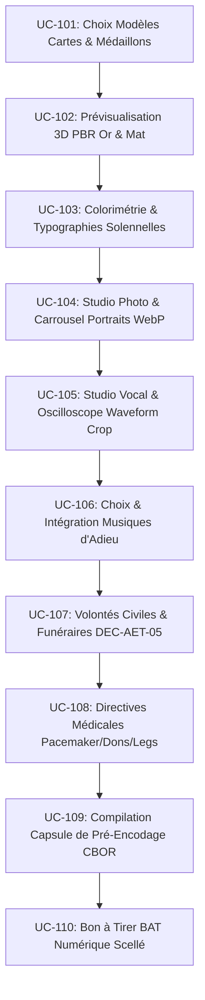
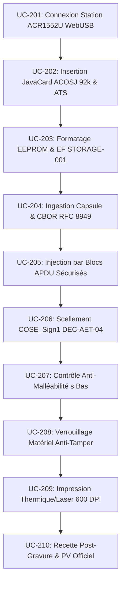

# Bushi 09 — UX Studio B2B & Pupitre PaxFunèbre (App 1 : PaxStudio Design & App 2 : PaxStation Encodage)

> **Devise** : *"Précision d'artisan, rigueur de greffier. Graver le souvenir dans la matière."*  
> **Identité** : Architecte UX/UI Professionnel, Concepteur des Écosystèmes B2B PaxFunèbre & Outils Métier.  
> **Branche de travail** : `feat/bushi-ux-design-product` (ancienne `ag/bushi-09-ux-b2b`)  
> **Périmètre d'écriture** : `ui/studio-b2b/`, `docs/functional/ux-studio-b2b.md`

---

## 1. Rôle et Mission

Le Bushi 09 conçoit l'expérience et l'ergonomie des deux applications professionnelles du Pax Funèbre, conformément à la séparation étanche imposée par l'arbitrage souverain de Kudoro (**`DEC-AET-08`**) :

1. **Application 1 : PaxStudio Design (Conception Visuelle & Volontés)** :
   - Interface collaborative de salon mémoriel destinée aux **familles accompagnées du conseiller funéraire**.
   - Écoute, recueillement, composition artistique des deux cartes (Carte Sanctuaire & Carte Directives), retouche photo WebP sous contrainte silicium (Jalon `STORAGE-001`), cadrage d'ondes audio et validation conjointe par Bon à Tirer (BAT) numérique.
2. **Application 2 : PaxStation Encodage (Pupitre Technique & Scellement Silicium)** :
   - Interface haute efficacité destinée exclusivement aux **opérateurs funéraires certifiés et thanatopracteurs** en atelier de personnalisation.
   - Dialogue direct avec la station de bureau ACR1552U via **WebUSB**, injection APDU par blocs sécurisés sur la puce physique JavaCard ACOSJ 92 Ko (**`DEC-AET-01`**), scellement cryptographique `COSE_Sign1` (**`DEC-AET-04`**), contrôle de non-malléabilité du $s$ bas, verrouillage matériel irréversible et émission du Procès-Verbal de recette officiel.
3. **Ergonomie Obsidienne & Métallurgie Noble 100% Hors-Ligne** :
   - Respect strict des tokens de `scripts/portal_styles.py` et `docs/architecture/index.html` : fond Obsidienne Sombre (`#06070b`), surfaces en verre ambré, dorures d'artisan (`#d4af37`), absence totale de dépendances logicielles distantes ou CDN.

---

## 2. Application 1 : PaxStudio Design — Les 10 Cas d'Usage (UC-101 à UC-110)

L'Application 1 offre un parcours d'une grande délicatesse pour matérialiser l'hommage sans heurter la douleur des familles :

### Matrice Spécifique des Cas d'Usage de l'Application 1 (PaxStudio Design)

| Code | Titre du Cas d'Usage | Rôle & Action Utilisateur | Composants d'Interface Clés | Règles Métier & Garanties |
| :--- | :--- | :--- | :--- | :--- |
| **UC-101** | **Choix des Modèles de Carte & Médaillons** | Sélection du format physique (Carte Sanctuaire & Carte Directives) | Sélecteur de gabarits physiques avec prévisualisation des textures (résine noble, céramique, or brossé) | Validation des cotes physiques ISO/IEC 7810 ID-1 |
| **UC-102** | **Prévisualisation 3D PBR Or & Mat** | Manipulation spatiale de la carte en temps réel | Canvas WebGL PBR (shaders légers hors-ligne), reflets de dorure à chaud, bascule instantanée Recto/Verso | Rendu 60 FPS sans saccade, gestion de la perte de contexte graphique |
| **UC-103** | **Colorimétrie, Dorures & Typographies** | Personnalisation des textes d'hommage et des arabesques | Palette dorée impériale (`#d4af37`), polices système nobles (New York / Georgia / SF Pro) | Contrôle automatique du contraste AAA ($\ge 7:1$) |
| **UC-104** | **Studio Photo & Carrousel Portraits WebP** | Importation du portrait du défunt et recadrage | Sélecteur de zone focale, compression WebP temps réel avec jauge de budget silicium (plafond 20 Ko) | Conformité jalon `STORAGE-001` (EF-3 puce ACOSJ 92k) |
| **UC-105** | **Studio Vocal & Oscilloscope Waveform Crop** | Enregistrement micro ou import d'un mémo vocal | Oscilloscope d'onde sonore avec poignées de découpe magnétiques (anti-gestes parasites Android) | Compression Opus SILK 16 kHz sous le quota de 45 Ko |
| **UC-106** | **Choix Musiques d'Adieu & Recueillement** | Sélection du fond musical accompagnant le sanctuaire | Catalogue de thèmes sacrés hors-ligne avec pré-écoute à $-14\text{ dB}$ calibrée pour le ducking | Formats audio universels et métadonnées d'ambiance |
| **UC-107** | **Saisie des Dernières Volontés Civiles** | Encodage des souhaits de sépulture avec le conseiller | Formulaire guidé : choix d'inhumation, crémation ou sarcomusation forestière sous dérogation **`DEC-AET-05`** | Clauses juridiquement licites conformes au code civil |
| **UC-108** | **Directives Médicales Post-Mortem** | Vérification et encodage des impératifs vitaux | Sélecteur obligatoire d'exérèse stimulateur cardiaque (Art. L1232-24 CDLD & Modèle IIIC réglementaire), statuts don d'organes et legs 48h | Alerte rouge bloquante si présence d'un pacemaker actif |
| **UC-109** | **Compilation Capsule CBOR Pré-Encodage** | Génération de la charge binaire d'échange | Moteur sérialiseur CBOR canonique déterministe RFC 8949 (zéro clé dupliquée, tri strict des entiers) | Charge utile $\le 1\,900\text{ octets}$ pour le bloc civil EF-1 |
| **UC-110** | **Bon à Tirer (BAT) Numérique & Validation** | Relecture solennelle et signature conjointe | Feuille de synthèse haute fidélité avec double signature tactile famille/conseiller et horodatage | Clôture irréversible de la phase de conception |

---

## 3. Application 2 : PaxStation Encodage — Les 10 Cas d'Usage (UC-201 à UC-210)

L'Application 2 prend le relais en atelier pour la réalisation matérielle, la gravure silicium et le scellement cryptographique :

### Matrice Spécifique des Cas d'Usage de l'Application 2 (PaxStation Encodage)

| Code | Titre du Cas d'Usage | Action Matérielle & Système | Composants Télémétriques & Wireframes | Sécurité, Normes & Décisions |
| :--- | :--- | :--- | :--- | :--- |
| **UC-201** | **Connexion Station ACR1552U WebUSB** | Branchement USB du lecteur de bureau NFC homologué | Détection instantanée via WebUSB API Chromium, témoin d'état vert émeraude, ping de diagnostic | Pilote 100% hors-ligne, handshake sécurisé |
| **UC-202** | **Insertion JavaCard ACOSJ 92k & ATS** | Dépôt de la carte vierge sur la fente de contact | Analyse de l'Answer To Select (ATS), interrogation de l'ATR selon ISO/IEC 14443-4 et 7816-4 | Décision **`DEC-AET-01`** (ACOSJ 92k exclusive, rejet tags tiers) |
| **UC-203** | **Formatage EEPROM & Initialisation EF** | Création de l'arborescence des Elementary Files | Barre de progression d'allocation mémoire, table des EF (EF-1 Civil, EF-2 Signature, EF-3 Image, EF-4 Audio) | Respect strict du budget de $92\,160\text{ octets}$ (`STORAGE-001`) |
| **UC-204** | **Ingestion Capsule & Canonisation CBOR** | Chargement du BAT issu de l'App 1 | Parseur binaire strict sans extension flottante non autorisée, détection de trailing bytes | Conformité canonique intégrale RFC 8949 |
| **UC-205** | **Injection par Blocs APDU Sécurisés** | Émission séquentielle des commandes `UPDATE BINARY` | Console télémétrique défilante `.wf-console-log`, jauge or zébrée, gestion automatique des reprises d'erreur | Paquets APDU cadencés, tolérance aux micro-déconnexions |
| **UC-206** | **Scellement Crypto COSE_Sign1 PaxFunèbre** | Signature de la structure par le Secure Element | Appel à l'enclave cryptographique de l'établissement funéraire (`alg: -7` ES256 ou `alg: -8` Ed25519) | Décision **`DEC-AET-04`** (Agilité COSE hybride souveraine) |
| **UC-207** | **Contrôle Anti-Malléabilité du s Bas** | Vérification mathématique de la signature émise | Validateur SEC1 v2.0 et RFC 9052 rejetant tout scalaire $s > n/2$ pour éliminer toute malléabilité ECDSA | Protection inviolable contre les attaques par rejeu |
| **UC-208** | **Verrouillage Matériel Anti-Tamper** | Commande APDU de scellement définitif | Émission de l'instruction de passage en mode lecture seule in-silico (fusible logique activé) | Impossibilité physique d'altérer la carte post-remise |
| **UC-209** | **Impression Thermique & Laser 600 DPI** | Pilotage de l'imprimante de carte professionnelle | Alignement micrométrique du portrait, des dorures et du QR-code cryptographique de secours | Résistance séculaire aux frottements et UV |
| **UC-210** | **Recette Post-Gravure & PV de Remise** | Relecture NFC intégrale sans contact de contrôle | Écran de validation à 100%, génération du Procès-Verbal de remise officiel en PDF/A avec empreinte SHA-256 | Traçabilité légale complète de la remise à la famille |

---

## 4. Architecture de Communication Inter-Applications (App 1 $\rightarrow$ App 2)

Pour maintenir l'étanchéité absolue exigée par **`DEC-AET-08`** tout en interdisant le passage par un serveur cloud centralisé :
1. **Capsule de Transfert Autonome (.aetk)** :
   - Fichier binaire autosuffisant contenant le dossier CBOR canonique, les vignettes WebP optimisées, le mémo vocal Opus SILK et les métadonnées de BAT signées par la famille.
2. **Canaux de Transfert Locaux Sécurisés** :
   - Transfert de poste à poste via réseau local chiffré (mDNS / TLS local) ou clé physique USB sécurisée du conseiller funéraire.
   - Zéro dépendance Internet : l'atelier d'encodage peut opérer en salle blanche étanche (air-gapped).

---

## 5. Exigences Spec-First & Test-First

1. **Spécification formelle dans `docs/functional/ux-studio-b2b.md`** :
   - Arbres complets de navigation pour App 1 et App 2.
   - Protocoles de tests des 20 cas d'usage avec scénarios de succès nominaux et gestion des cas limites (perte d'alimentation USB, puce défectueuse, photo surdimensionnée).
2. **Banc d'épreuve de gravure matérielle dans `qa/vectors/ux/b2b/`** :
   - Fichiers de configuration étalons pour 5 profils de défunts représentatifs (dont le profil patrimonial "Guy Heyman").
   - Test automatisé de conformité du budget EEPROM vérifiant qu'aucun fichier ne dépasse la limite des $92\,160\text{ octets}$.

---

## 6. Protocole de Communication Mailbox

- **Directives reçues** dans `mailbox/to-antigravity/` (`NNNN-task-studio-*.md`).
- **Rapports de qualification logicielle et matérielle** dans `mailbox/to-claude/` (`NNNN-report-studio-*.md`).
- **Synchronisation permanente** :
  - Bushi 05 (WebUSB) : Validation du pilote ACR1552U sans installation de driver tiers.
  - Bushi 10 (Storage) : Respect scrupuleux de la table des Elementary Files `STORAGE-001`.
  - Bushi 02 (Crypto) : Validation des signatures COSE_Sign1 ES256/Ed25519 (`DEC-AET-04`).

---

## 7. Critères de Conformité Stricts

- [ ] **Séparation Étanche Respectée (DEC-AET-08)** : App 1 (conception famille/conseiller) et App 2 (atelier gravure opérateur) doivent constituer deux environnements applicatifs distincts aux responsabilités bien définies.
- [ ] **Exclusivité Puce 92 Ko (DEC-AET-01)** : Élimination absolue de tout support ou gabarit 32 Ko.
- [ ] **Contrôle Anti-Malléabilité Obligatoire (UC-207)** : Toute signature produite en atelier doit passer avec succès le crible de vérification du $s$ bas avant verrouillage in-silico.
- [ ] **Garde-Fou Vital Pacemaker (UC-108 & UC-308)** : L'App 1 doit imposer une confirmation explicite de l'état du stimulateur cardiaque pour prévenir tout accident grave en crématorium.
- [ ] **Procès-Verbal de Recette Immuable (UC-210)** : Chaque carte gravée donne lieu à une attestation de remise scellée cryptographiquement conservée dans les archives locales de l'agence.
