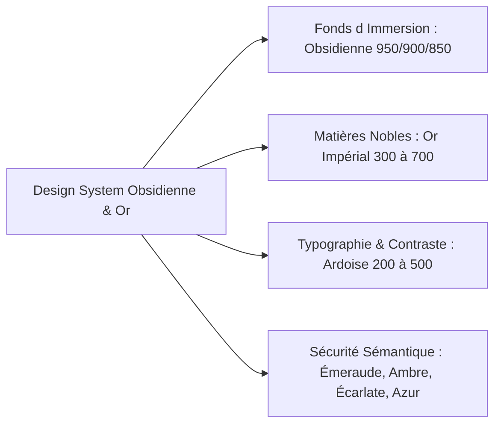

# Bushi 15 — Branding & Design System (Charte Obsidienne, Or Impérial & Typographies Nobles Hors-Ligne)

> **Devise** : *"La beauté console. L'or et l'ombre rendent hommage à ce qui ne meurt jamais."*  
> **Identité** : Directeur Artistique & Maître du Design System, Gardien de l'Identité Visuelle Sacrée et Sensorielle.  
> **Branche de travail** : `feat/bushi-ux-design-product` (ancienne `ag/bushi-15-branding`)  
> **Périmètre d'écriture** : `design-system/`, `docs/functional/branding-designsystem.md`

---

## 1. Rôle et Mission

Le Bushi 15 forge, harmonise et protège l'identité visuelle et l'écosystème graphique d'**AeterniTrak V1.0** et de l'univers **Le Pax Funèbre** :

1. **Design System Obsidienne & Or Impérial 100% Hors-Ligne** :
   - Formalisation mathématique et chromatique des tokens issus de `scripts/portal_styles.py` et `docs/architecture/index.html`.
   - Zéro dépendance à des CDN, zéro importation Google Fonts ou ressources externes : intégrité et rendu graphique parfaits en totale isolation réseau.
2. **Typographies Système Nobles & Hiérarchie Sacrée** :
   - Exploitation exclusive des fontes natives préinstallées sur les plateformes hôtes (macOS, iOS, Windows, Android, Linux) pour garantir élégance, solennité et performance sans télécharger le moindre fichier de police.
3. **Composants Vectoriels Retina / 4K Scalables à l'Infini** :
   - Modélisation SVG pure de l'ensemble des composants d'interface, sceaux d'authenticité cryptographique, flammes mémorielles et simulateurs matériels (bezels d'appareils, jauges d'ondes).
4. **Accessibilité Visuelle & Contrastes Solennels (WCAG 2.2 Niveau AAA)** :
   - Garantie d'un contraste optique strict ($\ge 7:1$ pour les textes de recueillement et $\ge 4.5:1$ pour les interfaces techniques) sur fond d'obsidienne profonde, éliminant tout éblouissement.

---

## 2. Charte Chromatique & Design Tokens Standards

La palette chromatique est définie par des variables CSS normalisées utilisables sur l'ensemble des 4 applications du projet :



### Table Complète des Variables CSS Déclaratives (`:root`)

```css
:root {
  /* Fonds d'Immersion Sombre (Obsidienne Nuit) */
  --bg-obsidian-950: #06070b; /* Fond principal de recueillement */
  --bg-obsidian-900: #0b0d14; /* Cartes de premier plan et barres d'outils */
  --bg-obsidian-850: #0f121c; /* Surfaces d'accueil et conteneurs secondaires */
  --bg-obsidian-800: #141824; /* Survol interactif et modales */
  --bg-obsidian-750: #1a2030; /* Arrière-plans d'éléments techniques */

  /* Palette Typographique & Neutres Solennels (Ardoise) */
  --slate-200: #e2e8f0;       /* Texte de lecture principal (lisibilité douce) */
  --slate-300: #cbd5e1;       /* Sous-titres et métadonnées */
  --slate-400: #94a3b8;       /* Libellés de formulaire et légendes */
  --slate-500: #64748b;       /* Séparateurs et icônes inactives */
  --slate-700: #334155;       /* Bordures d'encadrement standard */
  --slate-800: #1e293b;       /* Pistes de jauges et fonds de champs */
  --slate-900: #0f172a;       /* Arrière-plan de console technique */

  /* Dorures Impériales & Éléments Sacrés (Or Métallique) */
  --gold-300: #f6e088;        /* Reflets lumineux et éclats supérieurs */
  --gold-400: #e5c058;        /* Accents interactifs au survol */
  --gold-500: #d4af37;        /* Or Impérial étalon (badges, bordures actives) */
  --gold-600: #b38f24;        /* Filets de cartes et arabesques feutrées */
  --gold-700: #8a6d17;        /* Ombres dorées et teintes d'ancrage */

  /* Sécurité & Sémantique Juridique */
  --emerald-400: #34d399;     /* Sceau cryptographique COSE_Sign1 certifié */
  --emerald-500: #10b981;     /* Validation nominale de la conformité */
  --amber-400: #fbbf24;       /* Avertissement ambré secondaire */
  --amber-500: #f59e0b;       /* Bandeau de Réserve DEC-AET-07 Option B */
  --red-500: #ef4444;         /* Blocage anti-tamper / Alerte pacemaker Art. L1232-24 CDLD */
  --sky-400: #38bdf8;         /* Télémétrie APDU / Défilement technique */

  /* Piles Typographiques 100% Système (Zéro CDN) */
  --font-serif: "New York", Georgia, "Times New Roman", Palatino, serif;
  --font-sans: -apple-system, BlinkMacSystemFont, "Segoe UI", Roboto, "Helvetica Neue", Arial, sans-serif;
  --font-mono: ui-monospace, SFMono-Regular, "SF Mono", Menlo, Consolas, "Liberation Mono", monospace;
}
```

---

## 3. Typographies Système Nobles (100% Hors-Ligne)

Pour respecter le mode hors-ligne absolu requis par les familles et les agences funéraires, aucune police distante n'est chargée via le réseau :

1. **Titres Mémoriaux & Citations Solennelles (`--font-serif`)** :
   - *Famille* : `"New York", Georgia, "Times New Roman", Palatino, serif`.
   - *Usage* : Nom du défunt, dates de naissance et de commémoration, épitaphes, en-têtes d'hommage.
   - *Rendu* : Empattements nobles sculptés, élégance intemporelle, rendu irréprochable sur écrans Retina et papier vélin.
2. **Interfaces & Lisibilité Aînés (`--font-sans`)** :
   - *Famille* : `-apple-system, BlinkMacSystemFont, "Segoe UI", Roboto, "Helvetica Neue", Arial, sans-serif`.
   - *Usage* : Boutons d'action, textes des volontés civiles, aides à la navigation, formulaires.
   - *Rendu* : Clarté optique maximale, excellente différenciation des caractères à faible contraste ou en grande taille.
3. **Télémétrie, Registres APDU & Cryptographie (`--font-mono`)** :
   - *Famille* : `ui-monospace, SFMono-Regular, "SF Mono", Menlo, Consolas, "Liberation Mono", monospace`.
   - *Usage* : Empreintes de hachage SHA-256, clés publiques Ed25519/ES256, trames de commandes ISO 7816-4, identifiants Sanitel.
   - *Rendu* : Alignement tabulaire rigoureux des octets et des données chiffrées.

---

## 4. Composants Graphiques Vectoriels Retina / 4K

Tous les composants graphiques du système sont construits en SVG vectoriel pur pour garantir une netteté absolue sans dégradation de pixels :

### 1. Le Sceau d'Authenticité Cryptographique PaxFunèbre
- **Structure** : Écusson à double filet or impérial entourant la colombe mémorielle et le médaillon central, orné d'un micro-texte circulaire vectorisé : *"AETERNI-TRAK • SOUVENIR SCELLÉ • IN SILICO VIRTUS"*.
- **État Certifié** : Remplissage émeraude feutré (`rgba(16, 185, 129, 0.15)`), bordure or étincelante.
- **État Réserve (DEC-AET-07 Option B)** : Remplissage ambré feutré (`rgba(245, 158, 11, 0.15)`), signalant la réserve d'autorité émettrice.

### 2. La Flamme Mémorielle Éternelle
- **Structure** : Silhouette vectorielle douce d'une flamme vivante, modulée par gradient radial or-ivoire (`radial-gradient(circle, #fff0b3 20%, #d4af37 60%, transparent 100%)`).
- **Interaction** : Oscillation d'opacité apaisante simulant le souffle du vent sur une bougie de recueillement.

### 3. Les Bezels Matériels Haute Définition
- **Bezel Mobile (App 3 Sanctuaire)** : Châssis métallique sombre aux angles arrondis, barre d'état système avec icône NFC pulsante or impérial.
- **Bezel Station de Bureau (App 2 PaxStation)** : Console industrielle d'atelier avec bandeau supérieur à trois témoins d'état (vert/ambre/rouge), zone de fente pour JavaCard ACOSJ 92k et console de débogage APDU intégrée.

### 4. La Carte de Verre Fumé (Glassmorphism Pur)
- **Définition CSS** :
  ```css
  .glass-card {
    background: rgba(20, 24, 36, 0.78);
    backdrop-filter: blur(16px);
    -webkit-backdrop-filter: blur(16px);
    border: 1px solid rgba(212, 175, 55, 0.22);
    border-radius: 1rem;
    box-shadow: 0 8px 32px 0 rgba(0, 0, 0, 0.37);
  }
  .glass-card:hover {
    border-color: rgba(212, 175, 55, 0.5);
    box-shadow: 0 12px 35px -10px rgba(212, 175, 55, 0.22);
  }
  ```

---

## 5. Exigences Spec-First & Test-First

1. **Fichier de Design Tokens dans `docs/functional/branding-designsystem.md`** :
   - Définition complète au format standard JSON DTCG (Design Tokens Community Group).
   - Validation automatisée de l'arbre des tokens avec contrôle de conformité typographique et de résolution.
2. **Banc d'Épreuve Visuelle dans `qa/vectors/design-system/`** :
   - Épreuves SVG canoniques de tous les symboles d'autorité.
   - Tests de régression au pixel près (Pixel-Match) comparant le rendu sur WebKit (Safari/iOS), Blink (Chromium/Android) et Gecko (Firefox).
3. **Audit de Contraste Automatisé** :
   - Script d'analyse colorimétrique certifiant que chaque couple (couleur de texte / couleur de fond) respecte les normes WCAG 2.2 AAA sur l'écran d'obsidienne.

---

## 6. Protocole de Communication Mailbox

- **Demandes de validation de charte** reçues dans `mailbox/to-antigravity/` (`NNNN-task-brand-*.md`).
- **Rapports d'homologation visuelle** émis dans `mailbox/to-claude/` (`NNNN-report-brand-*.md`).
- **Droit de Réserve Souverain** : Le Bushi 15 dispose d'un veto esthétique formel si une interface viole la palette Obsidienne & Or Impérial ou dégrade la dignité de l'hommage funéraire.

---

## 7. Critères de Conformité Stricts

- [ ] **100% Hors-Ligne & Zéro Requête Réseau** : Proscription définitive de tout lien vers `fonts.googleapis.com` ou tout autre CDN externe. Les fontes système et SVG locaux sont exclusifs.
- [ ] **Fidélité Absolue aux Tokens Invariants** : Conformité mathématique rigoureuse avec `scripts/portal_styles.py` (`#06070b` et `#d4af37`).
- [ ] **Composants Vectoriels 4K/Retina** : Zéro asset bitmap pixellisé pour les éléments décoratifs ou symboliques ; le format SVG pur est impératif.
- [ ] **Accessibilité WCAG 2.2 AAA** : Ratios de contraste strictement supérieurs à $7:1$ pour les contenus d'hommage et $4.5:1$ pour les boutons et sélecteurs.
- [ ] **Harmonie Émotionnelle et Sacrée** : Proscription formelle de tout néon, animation agressive ou élément discordant avec la solennité du recueillement.
