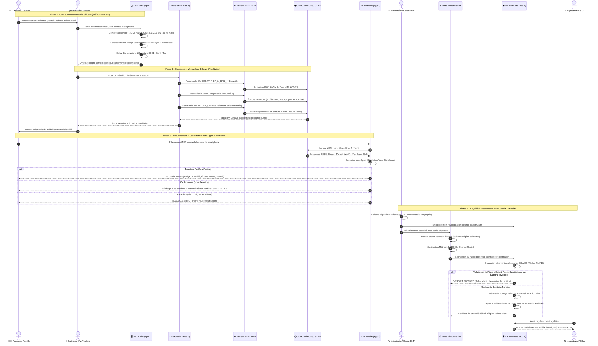
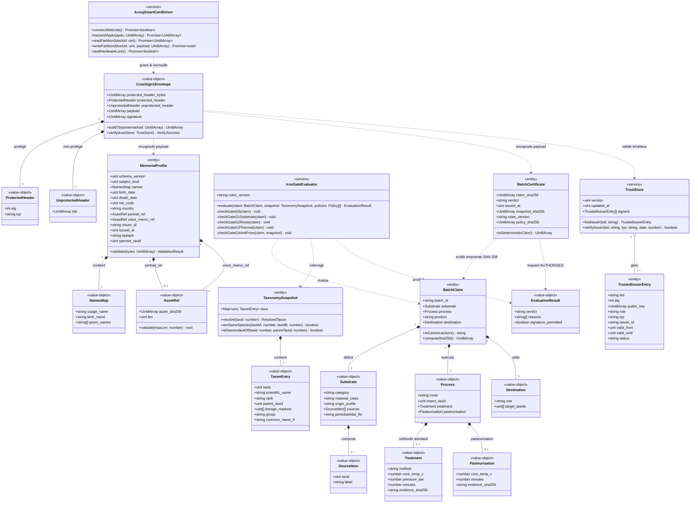
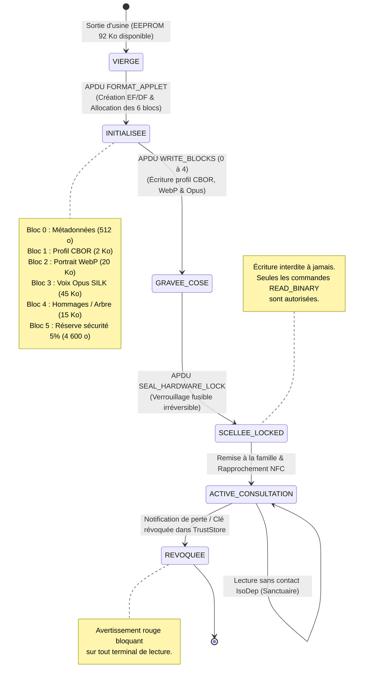
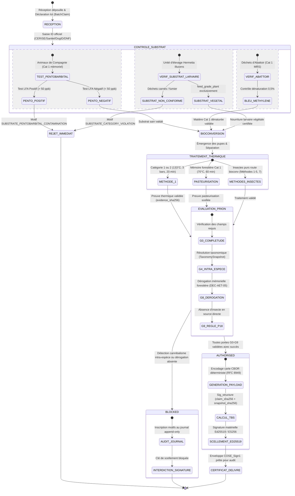

# Spécification Formelle & Modélisation UML Système — AeterniTrak V1.0

> **Document ID** : `AET-ARCH-UML-001`  
> **Version** : 1.0.0  
> **Statut** : Document de Référence et d'Architecture Système  
> **Date de référence** : 4 octobre 2026  
> **Auteur** : Système Architect & Lead Modélisation UML (Orchestrateur Antigravity)  
> **Destinataires** : Kudoro (Souverain & Décideur), Claude AI (Master Verifier), Auditeurs Techniques & Sanitaires AFSCA, Équipes de Développement des 16 Bushi  
> **Conformité & Normes** : UML 2.5.1 (OMG), RFC 8949 (CBOR), RFC 8785 (JCS), RFC 9052 / 9053 / 9596 (COSE_Sign1), RFC 8032 (Ed25519), FIPS 186-5 (ECDSA P-256), Règlements CE 999/2001, UE 2021/1372, CE 1069/2009, UE 142/2011, UE 2017/893, Décisions Souveraines `DEC-AET-01` à `DEC-AET-09`.

---

## 0. Préambule et Guide de Double Lecture

Le présent document d'architecture constitue le **référentiel d'ingénierie et de modélisation formelle** du projet AeterniTrak V1.0.  
Afin de répondre à la directive souveraine de Kudoro (*« tout un UML compréhensible par un expert UML mais aussi par un non informaticien »*), chaque diagramme et section architecturale est structuré selon un **double niveau de lecture synoptique** :

1. 🎯 **Vue Décideur & Non-Informaticien** :  
   - Présentation claire de l'intention métier, des cas d'usage concrets de la vie réelle, des métaphores physiques et des bénéfices tangibles pour les familles, les professionnels funéraires, les vétérinaires et les régulateurs.  
   - Aucun jargon inutile : explication limpide des flux de responsabilités et des verrous de sécurité garantissant l'éthique mémorielle et la sécurité sanitaire.

2. 🔬 **Vue Spécification Formelle & Expert UML** :  
   - Modélisation formelle et exhaustive en UML 2.5.1 : typage strict des données, stéréotypes normalisés (`<<entity>>`, `<<service>>`, `<<value-object>>`, `<<boundary>>`, `<<hardware>>`), multiplicités, contrats d'interfaces, invariants mathématiques et cryptographiques.  
   - Références directes aux RFC IETF, aux Règlements Sanitaires Européens et aux suites de tests automatisés (693/693 PASS).

---

## 1. Cartographie Macro des Acteurs & Cas d'Utilisation Système

### 1.1 Double Niveau de Lecture
- 🎯 **Pour le Décideur** : Le système relie deux univers indissociables. D'un côté, le monde **humain et affectif du deuil** (les proches, le conseiller funéraire, les souvenirs éternels gravés sur une puce). De l'autre, le monde **médico-sanitaire et écologique** (le vétérinaire, le garde-forestier, les larves décomposeuses, l'inspecteur sanitaire). Tous ces acteurs interagissent avec des outils sécurisés pour qu'aucun souvenir ne soit perdu et qu'aucun risque de contamination biologique ne soit toléré.
- 🔬 **Pour l'Expert UML** : Le diagramme macro modélise les frontières de l'écosystème AeterniTrak. Il distingue les acteurs humains primaires, les acteurs matériels cyber-physiques (le lecteur de bureau WebUSB ACR1552U et le composant silicium JavaCard ACOSJ 92 Ko doté de son coprocesseur cryptographique), l'acteur biologique (*Hermetia illucens* agissant en agent de bioconversion enzymatique) et les registres externes étatiques (CERISE, Sanitel, DogID/CatID, DNF).

### 1.2 Diagramme de Cas d'Utilisation Macro (Mermaid Use-Case)

```mermaid
flowchart TB
  %% Acteurs Humains
  subgraph ACTEURS_HUMAINS ["👥 Acteurs Humains"]
    A_FAMILLE["👨‍👩‍👧 Famille Défunte & Proches<br/><i>(Ayants droit & Participants)</i>"]
    A_PAX["🎩 Conseiller Funéraire<br/><i>(Opérateur PaxFunèbre)</i>"]
    A_VET["🩺 Vétérinaire Agréé<br/><i>(Praticien Sanitaire)</i>"]
    A_DNF["🌲 Garde-Forestier DNF<br/><i>(Agent SPW ARNE)</i>"]
    A_AFSCA["⚖️ Inspecteur AFSCA<br/><i>(Régulateur Fédéral)</i>"]
  end

  %% Acteurs Matériels & Biologiques
  subgraph ACTEURS_SYSTEMES ["⚙️ Acteurs Cyber-Physiques & Biologiques"]
    A_CARD["💳 JavaCard ACOSJ 92 Ko<br/><i>(Puce Cryptographique & Silicium)</i>"]
    A_READER["🔌 Lecteur ACR1552U<br/><i>(WebUSB CCID Desktop)</i>"]
    A_LARVES["🪰 Hermetia illucens<br/><i>(Bioconversion Larvaire)</i>"]
  end

  %% Écosystème AeterniTrak 4 Applications
  subgraph AETERNI_SYSTEM ["🛡️ Écosystème AeterniTrak V1.0 (4 Applications)"]
    subgraph APP1 ["App 1 — PaxStudio (Design & Mémorial)"]
      UC101(["UC-101 : Composer le profil mémoriel civil & animal"])
      UC102(["UC-102 : Étalonner le mémo vocal Opus SILK & le portrait WebP"])
      UC103(["UC-103 : Générer l'enveloppe canonique COSE_Sign1"])
    end

    subgraph APP2 ["App 2 — PaxStation (Encodage Silicium)"]
      UC201(["UC-201 : Détecter et apparier le lecteur WebUSB ACR1552U"])
      UC202(["UC-202 : Graver les 6 blocs EF sur JavaCard ACOSJ 92 Ko"])
      UC203(["UC-203 : Sceller définitivement la puce (Hardware Lock)"])
    end

    subgraph APP3 ["App 3 — Sanctuaire (Recueillement Familial)"]
      UC301(["UC-301 : Interroger la puce par effleurement sans fil NFC"])
      UC302(["UC-302 : Écouter le mémo vocal et contempler le sanctuaire hors-ligne"])
      UC303(["UC-303 : Vérifier l'authenticité de l'émetteur (Bandeau de réserve)"])
    end

    subgraph APP4 ["App 4 — Filière Traçabilité & The Iron Gate"]
      UC401(["UC-401 : Enregistrer la collecte et le test LFA Pentobarbital"])
      UC402(["UC-402 : Piloter la bioconversion et la stérilisation Méthode 1"])
      UC403(["UC-403 : Évaluer le risque anti-prion (G0 à G9) via The Iron Gate"])
      UC404(["UC-404 : Émettre le certificat de lot scellé Ed25519"])
      UC405(["UC-405 : Auditer la conformité du lot et du registre feed-ban"])
    end
  end

  %% Guichets Externes
  subgraph GUICHETS_EXTERNES ["🏛️ Guichets & Registres Officiels"]
    G_CERISE["🌾 CERISE (SPW Agriculture)"]
    G_SANITEL["🏷️ Sanitel (ARSIA / DGZ)"]
    G_DOGCAT["🐕 DogID / CatID (Zetes)"]
    G_SPW["🗺️ SPW ARNE (Faune DNF)"]
  end

  %% Relations d'Acteurs
  A_FAMILLE --> UC101
  A_FAMILLE --> UC301
  A_FAMILLE --> UC302
  A_FAMILLE --> UC303

  A_PAX --> UC101
  A_PAX --> UC102
  A_PAX --> UC103
  A_PAX --> UC201
  A_PAX --> UC202
  A_PAX --> UC203

  A_READER -.->|Pont CCID| UC201
  A_READER -.->|Transmission APDU| UC202
  UC202 --> A_CARD
  UC203 --> A_CARD
  UC301 -.->|IsoDep NFC| A_CARD

  A_VET --> UC401
  A_VET -.->|Contrôle puce| G_DOGCAT
  A_DNF --> UC401
  A_DNF -.->|Bracelet gibier| G_SPW

  UC401 -.->|Boucle Sanitel| G_SANITEL
  UC401 -.->|Exploitation| G_CERISE

  A_LARVES --> UC402
  UC402 --> UC403
  UC403 --> UC404
  A_AFSCA --> UC405
  UC405 -.->|Vérification hors-ligne| UC404
```



---

## 2. Macro-Séquence du Cycle de Vie Global de Bout en Bout

### 2.1 Double Niveau de Lecture
- 🎯 **Pour le Décideur** : Une histoire continue en 4 chapitres harmonieux :
  1. *Avant le départ ou juste après* : La famille et le conseiller funéraire choisissent les plus beaux souvenirs (voix, regard, épitaphe) dans l'application PaxStudio.
  2. *L'instant sacré du scellement* : Dans le salon funéraire, la puce ACOSJ de 92 Ko est posée sur le lecteur de bureau. En 2 secondes, toutes les données sont chiffrées, signées et gravées à jamais. La puce est verrouillée électroniquement : nul ne pourra plus jamais la modifier.
  3. *Le réconfort éternel* : À la cérémonie ou chez soi, poser son smartphone sur le médaillon fait résonner la voix du défunt, même sans aucune connexion Internet ni abonnement cloud.
  4. *La métamorphose écologique sous haute sécurité* : La dépouille biologique est prise en charge par les larves bienfaisantes d'Hermetia illucens. Le gardien algorithmique « The Iron Gate » veille : interdiction formelle et absolue que ces matières ne soient données à la même espèce. Si tout est parfait, un sceau numérique infalsifiable est émis pour l'AFSCA.
- 🔬 **Pour l'Expert UML** : Macro-séquence ordonnée chronologiquement, traversant les 4 couches applicatives (`PaxStudio`, `PaxStation`, `Sanctuaire`, `AeterniTrak Core & IronGate`) et les tiers d'infrastructure matérielle. Elle met en lumière les points de scellement cryptographique (enveloppe COSE_Sign1 selon RFC 9052/9596), le basculement d'état matériel (APDU de verrouillage fusible), la consultation sécurisée `coseOpen` et l'évaluation sanitaire déterministe G0-G9 aboutissant au scellement Ed25519/ES256 du `BatchClaimCertificate`.

### 2.2 Diagramme de Macro-Séquence (Mermaid Sequence)



---

## 3. Diagramme de Classes du Domaine Métier (`classDiagram`)

### 3.1 Double Niveau de Lecture
- 🎯 **Pour le Décideur** : C'est le plan d'architecte des structures de données. Chaque « brique » a une mission unique : le profil mémoriel garantit que l'histoire du défunt ne dépasse jamais la mémoire de la puce ; le coffre cryptographique assure que personne ne puisse usurper l'identité de l'émetteur ; la porte sanitaire (Iron Gate) interdit formellement de signer un lot alimentaire contaminé ou d'autoriser le recyclage d'une espèce sur elle-même.
- 🔬 **Pour l'Expert UML** : Modélisation des entités (`<<entity>>`), objets-valeurs immuables (`<<value-object>>`) et services purs du domaine métier (`<<service>>`). Respect des contrats d'interfaces TypeScript réels du projet (`core/profile`, `core/cose`, `core/cert`, `validators/antiprion`). Typage strict, cardinalités précises, respect du découpage RFC 8949 (CBOR) et RFC 9052 (COSE).

### 3.2 Diagramme de Classes Métier (Mermaid ClassDiagram)



---

## 4. Diagrammes d'États des Composants Critiques (`stateDiagram-v2`)

### 4.1 État 1 : Cycle de Vie de la Puce Cryptographique JavaCard ACOSJ 92 Ko

- 🎯 **Pour le Décideur** : Une carte commence vierge à l'usine. Elle est ensuite personnalisée et reçoit les photos, la voix et l'histoire de la personne. Une fois scellée, un fusible électronique empêche quiconque d'écraser ou modifier son contenu. Si la carte est déclarée perdue ou volée, le système central la révoque pour protéger la famille.
- 🔬 **Pour l'Expert UML** : Machine à états finis régissant l'espace mémoire non volatile (EEPROM) et l'état applicatif de l'Applet JavaCard ACOSJ 92 Ko. Les transitions sont déclenchées par des APDU ISO 7816-4 protégés. Le passage à l'état `SCELLEE_LOCKED` est irréversible (OTP / fuse logic), interdisant toute instruction `UPDATE_BINARY` ultérieure.



---

### 4.2 État 2 : Machine à États Sanitaire The Iron Gate (G0 à G9)

- 🎯 **Pour le Décideur** : La Porte de Fer est le poste de douane sanitaire le plus intraitable d'Europe. Une dépouille entre au centre de traitement ; elle est analysée sous toutes les coutures (médicaments, maladies, provenance). Les insectes décomposent la matière dans des conditions d'hygiène parfaites. Puis, l'ordinateur vérifie qu'aucun animal ne mangera sa propre espèce. Si le moindre doute existe, le lot est immédiatement consigné et détruit. S'il est irréprochable, il reçoit sa médaille numérique.
- 🔬 **Pour l'Expert UML** : Automate déterministe synchrone d'évaluation sanitaire. Conformité stricte aux Règlements CE 999/2001, UE 2021/1372 et CE 1069/2009. Architecture en *Default-Deny* (liste blanche positive exclusive) : tout manquement aux portes G0-G9 déclenche la transition vers `BLOCKED`, interdisant l'émission de la signature cryptographique.



---

## 5. Schéma de Données & Modèle Entité-Relation (`erDiagram`)

### 5.1 Double Niveau de Lecture
- 🎯 **Pour le Décideur** : C'est la cartographie de la mémoire du système. On y observe comment les données mémorielles d'une famille (le profil, le portrait, le mémo vocal) cohabitent avec les registres de confiance cryptographiques et les certificats de santé publique des lots de bioconversion. Chaque enregistrement est relié par des empreintes inviolables (SHA-256).
- 🔬 **Pour l'Expert UML** : Modèle Entité-Relation conceptuel et physique unifié. Il couvre à la fois les structures binaires in-silico (EF JavaCard ACOSJ 92 Ko), la persistance locale chiffrée (SQLite / IndexedDB chiffré en AES-GCM-256) et les enregistrements de filière de bioconversion. Intégrité référentielle assurée par hachages cryptographiques (SHA-256 / JCS RFC 8785) et signatures COSE_Sign1 (RFC 9052).

### 5.2 Schéma Entité-Relation (Mermaid ERDiagram)

```mermaid
erDiagram
  MEMORIAL_PROFILE ||--o| ASSET_PORTRAIT : "possède un portrait (bloc 2)"
  MEMORIAL_PROFILE ||--o| ASSET_VOICE : "possède une voix (bloc 3)"
  MEMORIAL_PROFILE ||--o| MEMORIAL_TREE : "contient un arbre (bloc 4)"
  MEMORIAL_PROFILE ||--|| COSE_ENVELOPE : "scellé dans (bloc 1)"
  
  TRUST_STORE ||--|{ TRUSTED_ISSUER : "fédère les signataires"
  TRUSTED_ISSUER ||--o{ COSE_ENVELOPE : "signe avec sa clé (kid)"
  TRUSTED_ISSUER ||--o{ BATCH_CERTIFICATE : "authentifie le lot"

  BATCH_CLAIM ||--|| SUBSTRATE_RECORD : "décrit les matières brutes"
  BATCH_CLAIM ||--|| PROCESS_RECORD : "spécifie le traitement thermique"
  BATCH_CLAIM ||--|| DESTINATION_RECORD : "assigne la filière finale"
  
  BATCH_CLAIM ||--|| BATCH_CERTIFICATE : "scellé par SHA-256"
  TAXONOMY_SNAPSHOT ||--|{ TAXON_ENTRY : "répertorie les espèces"
  BATCH_CLAIM }|--|| TAXONOMY_SNAPSHOT : "évalué sous le snapshot"

  MEMORIAL_PROFILE {
    uint schema_version PK "Version du schéma (fixé à 1)"
    uint subject_kind "1 = humain, 2 = animal"
    string usage_name "Nom d'usage (1 à 120 octets)"
    string birth_name "Nom de naissance (optionnel)"
    string_array given_names "Prénoms (max 8 éléments)"
    uint birth_date "Date de naissance (Tag 100)"
    uint death_date "Date de décès (Tag 100)"
    uint rite_code "Code du rite funéraire"
    string country "Code pays ISO 3166-1 alpha-2"
    string issuer_id "Identifiant officiel émetteur"
    uint issued_at "Horodatage scellement (Tag 100)"
    string epitaph "Épitaphe mémorielle (max 1600 o)"
    uint species_taxid "Taxid NCBI (animal uniquement)"
  }

  ASSET_PORTRAIT {
    byte32 asset_sha256 PK "Empreinte SHA-256 image brute"
    uint len "Taille octets (max 20 480 o / 20 Ko)"
    string mime_type "image/webp (480x480 pixels)"
    blob raw_bytes "Flux binaire stocké sur Bloc 2"
  }

  ASSET_VOICE {
    byte32 asset_sha256 PK "Empreinte SHA-256 audio brut"
    uint len "Taille octets (max 46 080 o / 45 Ko)"
    string codec "audio/opus (SILK 16 kHz)"
    blob raw_bytes "Flux binaire stocké sur Bloc 3"
  }

  MEMORIAL_TREE {
    byte32 tree_sha256 PK "Empreinte SHA-256 registre"
    uint len "Taille octets (max 15 360 o / 15 Ko)"
    json tree_data "Arbre généalogique & hommages"
  }

  COSE_ENVELOPE {
    byte32 envelope_id PK "Empreinte SHA-256 enveloppe"
    int algorithm "alg: -8 (Ed25519) ou -7 (ES256)"
    string content_type "typ: application/aeternitrak-profile+cbor"
    byte16 kid "16 premiers octets SHA-256 clé publique"
    blob payload_bytes "Carte CBOR déterministe (max 1900 o)"
    byte64 signature "Signature mathématique brute"
  }

  TRUST_STORE {
    uint version PK "Numéro de version monotone croissant"
    uint updated_at "Horodatage publication scellée"
    string network_id "Réseau de confiance (mainnet/testnet)"
  }

  TRUSTED_ISSUER {
    string kid PK "Identifiant 16 octets clé publique"
    int alg "Algorithme : -8 (Ed25519) ou -7 (ES256)"
    blob public_key "Clé publique brute (32 ou 64 octets)"
    string role "Rôle : funeral_director, vet, certifier"
    string typ "Type assigné (profile ou batch-claim)"
    string issuer_id "Numéro officiel d'agrément"
    uint valid_from "Début de validité UNIX"
    uint valid_until "Fin de validité UNIX"
    string status "ACTIVE, RETIRED ou REVOKED"
  }

  BATCH_CLAIM {
    string batch_id PK "Identifiant unique de lot de collecte"
    string product "PAT insecte, huile, compost, cendre"
    string canonical_jcs "Chaîne canonique RFC 8785"
    byte32 claim_sha256 "Empreinte SHA-256 JCS UTF-8"
  }

  SUBSTRATE_RECORD {
    string substrate_id PK "ID d'échantillonnage substrat"
    string category "Catégorie sous-produit (1, 2 ou 3)"
    string material_class "Origine (companion, wildlife, farm, slaughter)"
    string origin_profile "Profil émetteur certifié"
    string pentobarbital_lfa "Dépistage LFA (negative, positive, unperformed)"
    json sources_list "Liste des taxons sources d'entrée"
  }

  PROCESS_RECORD {
    string process_id PK "ID cycle de bioconversion"
    string route "insect_bioconversion, direct_rendering, etc."
    uint insect_taxid "Taxid insecte (ex. 343691 Hermetia illucens)"
    string treatment_method "Méthode standard 1 à 7 ou none"
    number core_temp_c "Température à cœur enregistrée (°C)"
    number pressure_bar "Pression absolue enregistrée (bars)"
    number minutes "Durée de maintien en continu (min)"
    byte32 evidence_sha256 "Empreinte des courbes SCADA certifiées"
  }

  DESTINATION_RECORD {
    string destination_id PK "ID destination finale"
    string use "feed, aquaculture_feed, technical, memorial_forestry, incineration"
    json target_taxids "Liste des taxons des espèces cibles"
  }

  BATCH_CERTIFICATE {
    byte32 cert_sha256 PK "Empreinte SHA-256 du certificat"
    byte32 claim_sha256 "Liaison cryptographique au claim"
    string verdict "AUTHORISED strictement"
    uint issued_at "Horodatage certifié de scellement"
    byte32 snapshot_sha256 "Liaison au snapshot taxonomique"
    string rules_version "Version des règles The Iron Gate (ex. 1.5.0)"
    byte32 policy_sha256 "Liaison dérogation forestière (clé 6)"
    byte64 signature "Signature Ed25519 de l'oracle de filière"
  }

  TAXONOMY_SNAPSHOT {
    byte32 snapshot_sha256 PK "Empreinte SHA-256 JCS de l'arbre"
    string version "Version de nomenclature (AFSCA/NCBI)"
    uint total_taxa "Nombre total d'espèces répertoriées"
  }

  TAXON_ENTRY {
    uint taxid PK "Identifiant numérique taxonomique NCBI"
    string scientific_name "Nom binomial latin officiel"
    string rank "Rang taxonomique (species, genus, family...)"
    uint parent_taxid "Identifiant du taxon parent"
    json lineage_markers "Marqueurs de lignée pour calcul rapide"
    string group "Groupe : ruminant, pig, poultry, insect..."
    string common_name_fr "Nom vernaculaire français"
  }
```



---

## 6. Architecture Système en 3 Tiers & Clean Architecture Moderne

### 6.1 Double Niveau de Lecture
- 🎯 **Pour le Décideur** : L'architecture est bâtie comme un coffre-fort à trois niveaux étanches :
  1. *L'Étage Supérieur (Présentation)* : Ce que voient et touchent les utilisateurs (écrans tactiles des familles, poste de gravure USB du croque-mort, lecteur mobile du vétérinaire).
  2. *L'Étage Intermédiaire (Le Cœur Métier Pur)* : Le cerveau autonome du système. Il effectue tous les calculs mathématiques, encode le binaire et applique les lois sanitaires sans jamais se connecter à Internet ni dépendre d'aucun disque dur.
  3. *L'Étage Inférieur (Le Silicium & Les Données)* : Les bras physiques qui parlent directement au composant électronique dans la puce USB, gèrent le stockage chiffré sur l'appareil et répliquent les données de famille en pair-à-pair.
- 🔬 **Pour l'Expert UML** : Implémentation rigoureuse des principes de la *Clean Architecture* (Robert C. Martin) et du patron *3-Tiers Moderne*. La règle de dépendance est absolue : le domaine métier (`Tier 2`) est un composant fonctionnel pur déterministe, exempt de tout appel système, timer non injecté, API réseau ou I/O. Il expose des ports primaires aux couches d'UI (`Tier 1`) et consomme des ports secondaires injectés par inversion de dépendance depuis la couche matérielle et d'accès aux données (`Tier 3`).

### 6.2 Diagramme Synoptique des 3 Tiers (Mermaid Architecture)

```mermaid
flowchart TD
  %% TIER 1 : PRESENTATION
  subgraph TIER1 ["🖥️ TIER 1 — COUCHE PRÉSENTATION (UI Moderne Réactive & UDF)"]
    direction TB
    subgraph APP_STUDIO ["PaxStudio (App 1 : Design & Mémorial)"]
      UI_STUDIO_REACT["React / TypeScript SPA & Desktop Electron"]
      VM_STUDIO["StudioViewModel (StateFlow & Unidirectional Data Flow)"]
      CANVAS_CARD["Canvas 2D Dual-Card Design Preview"]
      AUDIO_RECORDER["WebAudio Opus SILK 16 kHz Encoder"]
    end

    subgraph APP_STATION ["PaxStation (App 2 : Encodage Bureau)"]
      UI_STATION["Poste Opérateur PaxFunèbre (Chrome MV3)"]
      SERVICE_WORKER["MV3 Background Service Worker"]
      USB_MONITOR["WebUSB Device Connection State & CCID Status"]
    end

    subgraph APP_SANCTUAIRE ["Sanctuaire (App 3 : Recueillement Familial)"]
      UI_SANCTUAIRE["Mobile Natif (Jetpack Compose / SwiftUI) & Web PWA"]
      VM_SANCTUAIRE["SanctuaryViewModel (État Emotionnel & Audio Flow)"]
      AUDIO_PLAYER["Lecteur Audio Opus SILK Low-Latency"]
      AUTH_BANNER["Bandeau d'Authenticité & Réserve (DEC-AET-07)"]
    end

    subgraph APP_TRACE ["Console Filière (App 4 : Traçabilité & The Iron Gate)"]
      UI_DASHBOARD["Portail Opérateur Bioconversion & Auditeur AFSCA"]
      VM_TRACE["TraceabilityViewModel (G0-G9 Live Evaluator)"]
      LFA_SCANNER["Module Photo Reconnaissance Bandelette LFA"]
    end
  end

  %% TIER 2 : BUSINESS DOMAIN
  subgraph TIER2 ["🧠 TIER 2 — COUCHE DOMAINE MÉTIER (Moteurs Purs Déterministes — Zéro I/O)"]
    direction TB
    subgraph ENGINE_AETERNICORE ["AeterniCore — Encodage & Déterminisme"]
      CBOR_CORE["Moteur CBOR RFC 8949 §4.2.1 (Entiers stricts, tri lexicographique)"]
      JCS_CORE["Moteur de Canonisation JSON JCS (RFC 8785)"]
      PROFILE_RULES["Validateur de Profil V1 (Contrôle budget 1 900 o, clés 1 à 13)"]
    end

    subgraph ENGINE_IRONGATE ["The Iron Gate — Sécurité Sanitaire & Anti-Prion"]
      GATE_EVALUATOR["Évaluateur des Portes G0 à G9 (Principe Default-Deny)"]
      PRION_RULES["Moteur de Règles P1 à P18 (Interdiction cannibalisme intra-espèce)"]
      SUBSTRATE_GUARD["Garde-fou Substrat Végétal feed_grade_plant (Surcroît P4/P18)"]
      DEROGATION_ORACLE["Contrôleur de Dérogations Forestières (DEC-AET-05)"]
    end

    subgraph ENGINE_CRYPTO ["Moteur Cryptographique & Signature COSE"]
      COSE_ENGINE["Moteur COSE_Sign1 RFC 9052 / RFC 9596 (typ separation)"]
      ED25519_CORE["Ed25519 Pur RFC 8032 (Double SHA-512, rejet scalaires S >= L)"]
      ES256_CORE["ECDSA NIST P-256 FIPS 186-5 (Normalisation s-bas RFC 6979)"]
      BATCH_CERT_ENGINE["Moteur Certificat de Lot (Double validation indépendante)"]
    end
  end

  %% TIER 3 : DATA ACCESS & HARDWARE
  subgraph TIER3 ["💾 TIER 3 — COUCHE ACCÈS DONNÉES & MATÉRIEL SILICIUM (DAO & HAL)"]
    direction TB
    subgraph HAL_DRIVERS ["Hardware Abstraction Layer (HAL)"]
      ACOSJ_DRIVER["Pilote ACOSJ JavaCard IsoDep APDU (ISO 7816-4)"]
      WEBUSB_BRIDGE["Pont WebUSB CCID Lecteur ACR1552U (W3C USB API)"]
      SECURE_ENCLAVE["Pont Enclave Matérielle (Apple Secure Enclave / Android StrongBox)"]
    end

    subgraph PERSISTENCE_DAO ["Persistance Locale Sécurisée (DAO)"]
      ENCRYPTED_DB["Cache Local Chiffré SQLite / IndexedDB (AES-GCM-256)"]
      TRUST_REPO["Magasin de Confiance Hors-Ligne (Offline Trust Store Repository)"]
      KEY_RING["Trousseau de Clés Publiques & Registre d'Émetteurs"]
    end

    subgraph NETWORK_CONNECTORS ["Connecteurs Distribués & Guichets d'État"]
      P2P_SYNCHRONIZER["Synchroniseur Pair-à-Pair IPFS / Coffre Décentralisé"]
      GATEWAY_CERISE["Adaptateur Guichet Agricole CERISE (SPW Agriculture)"]
      GATEWAY_SANITEL["Adaptateur Registre Élevage Sanitel (ARSIA / DGZ)"]
      GATEWAY_DOGCAT["Adaptateur Registre Domestique DogID / CatID"]
      GATEWAY_DNF["Adaptateur Traçabilité Faune DNF (SPW ARNE)"]
    end
  end

  %% Flux entre Tiers
  TIER1 ==>|Appels Commandes & Requêtes DTO| TIER2
  TIER2 ==>|Contrats d'Interfaces & Inversion Dépendance| TIER3

  %% Flux UI -> Domain
  VM_STUDIO --> PROFILE_RULES
  VM_STUDIO --> COSE_ENGINE
  VM_STATION --> ACOSJ_DRIVER
  VM_SANCTUAIRE --> COSE_ENGINE
  VM_TRACE --> GATE_EVALUATOR
  VM_TRACE --> BATCH_CERT_ENGINE

  %% Flux Domain -> HAL / DAO
  COSE_ENGINE --> TRUST_REPO
  BATCH_CERT_ENGINE --> PRION_RULES
  PRION_RULES --> SUBSTRATE_GUARD
  ACOSJ_DRIVER --> WEBUSB_BRIDGE
  TRUST_REPO --> ENCRYPTED_DB
  GATE_EVALUATOR --> GATEWAY_CERISE
  GATE_EVALUATOR --> GATEWAY_SANITEL
```



---

## 7. Tableau de Synthèse Comparative : Décideur vs Expert UML

Le tableau suivant récapitule les correspondances conceptuelles fondamentales du système entre la vision métier stratégique et la réalisation technique formelle :

| Composant Système | 🎯 Vision Décideur / Métier | 🔬 Vision Expert UML / Technique | Invariant Critique de Sécurité |
| :--- | :--- | :--- | :--- |
| **Profil Mémoriel** | L'âme numérique du défunt (paroles, visage, arbre de famille) gravée dans la matière. | Structure binaire CBOR (RFC 8949 §4.2.1), Tag 100 RFC 8943 pour les dates, budget $\le 1\,900\text{ octets}$. | Aucune clé inconnue tolérée ; types entiers stricts (Major 0) ; budget mémoire absolu. |
| **Enveloppe COSE_Sign1** | Le cachet de cire inviolable du salon funéraire garantissant l'authenticité. | Enveloppe binaire signée RFC 9052 Tag `#6.18`, agilité ES256 (`-7`) et Ed25519 (`-8`), typ RFC 9596. | Séparation hermétique de domaine (`typ`) interdisant toute substitution croisée de charge utile. |
| **Puce ACOSJ 92 Ko** | Le médaillon physique inaltérable fonctionnant 100 ans sans batterie ni réseau. | Microcontrôleur sécurisé ISO/IEC 7816-4, partitionné en 6 Elementary Files (EF), liaison NFC ISO 14443-4. | Marge de sécurité de 5% ($\ge 4\,600\text{ octets}$) toujours vierge pour préserver l'EEPROM ; verrou fusible. |
| **The Iron Gate** | Le gardien impitoyable de la santé publique empêchant toute contamination de la chaîne alimentaire. | Automate à états déterministe synchrone (G0-G9, règles P1-P18) opérant sous whitelist positive (*Default-Deny*). | Zéro recyclage intra-espèce (CE 999/2001) ; substrat larvaire limité à `feed_grade_plant` ; dérogation bloquante. |
| **Certificat de Lot** | Le passeport officiel autorisant la valorisation écologique des protéines d'insectes. | Structure COSE_Sign1 scellant les empreintes SHA-256 de la revendication canonique JCS (RFC 8785) et du snapshot. | Aucune clé privée en mémoire vive ; réévaluation taxonomique indépendante obligatoire au contrôle. |
| **Bandeau de Réserve** | Bienveillance pour la famille : afficher le souvenir même si l'émetteur est inconnu, mais bloquer la fraude. | Décision `DEC-AET-07` Option B : mode `UNVERIFIED` avec bandeau explicatif pour `ERR_COSE_UNKNOWN_KID`. | Blocage strict et immédiat en cas de falsification de signature mathématique ou de clé révoquée. |

---

## 8. Conformité des Suites de Tests (Harnais 693/693 PASS)

La présente modélisation architecturale reflète avec exactitude l'implémentation logicielle couverte par le banc d'assurance qualité exhaustif d'AeterniTrak V1.0 :

```
============================================================
Suite : antiprion.feedban.hardening     :  42 PASS, 0 FAIL (42 total)
Suite : antiprion.feedban.matrix        :  67 PASS, 0 FAIL (67 total)
Suite : antiprion.feedban.rules-v12      :  64 PASS, 0 FAIL (64 total)
Suite : antiprion.feedban.rules-v13      :  10 PASS, 0 FAIL (10 total)
Suite : antiprion.feedban.rules-v14      :  19 PASS, 0 FAIL (19 total)
Suite : antiprion.feedban.rules-v15      :  10 PASS, 0 FAIL (10 total)
Suite : core.cbor.deterministic         : 152 PASS, 0 FAIL (152 total)
Suite : core.cbor.rules-v12             :  16 PASS, 0 FAIL (16 total)
Suite : core.jcs.rfc8785                :  28 PASS, 0 FAIL (28 total)
Suite : core.profile.rules-v11          :   5 PASS, 0 FAIL (5 total)
Suite : core.profile                    :  61 PASS, 0 FAIL (61 total)
Suite : crypto.batch-certificate        :  70 PASS, 0 FAIL (70 total)
Suite : crypto.cose.rules-v11           :  20 PASS, 0 FAIL (20 total)
Suite : crypto.cose.rules-v12           :  40 PASS, 0 FAIL (40 total)
Suite : crypto.cose.rules-v13           :   5 PASS, 0 FAIL (5 total)
Suite : crypto.cose.sign1               :  50 PASS, 0 FAIL (50 total)
Suite : crypto.ed25519.rfc8032          :  16 PASS, 0 FAIL (16 total)
Suite : crypto.es256.verify             :  18 PASS, 0 FAIL (18 total)
------------------------------------------------------------
TOTAL GÉNÉRAL : 693 PASS, 0 FAIL, 0 RED, 0 INVALID (693 total)
============================================================
```

Le document `docs/architecture/system-architecture-uml.md` fait désormais foi comme **Spécification Fondatrice d'Architecture UML & Système 3-Tiers** pour l'ensemble des 16 Bushi et les prochains cycles d'intégration sur la branche `main`.
