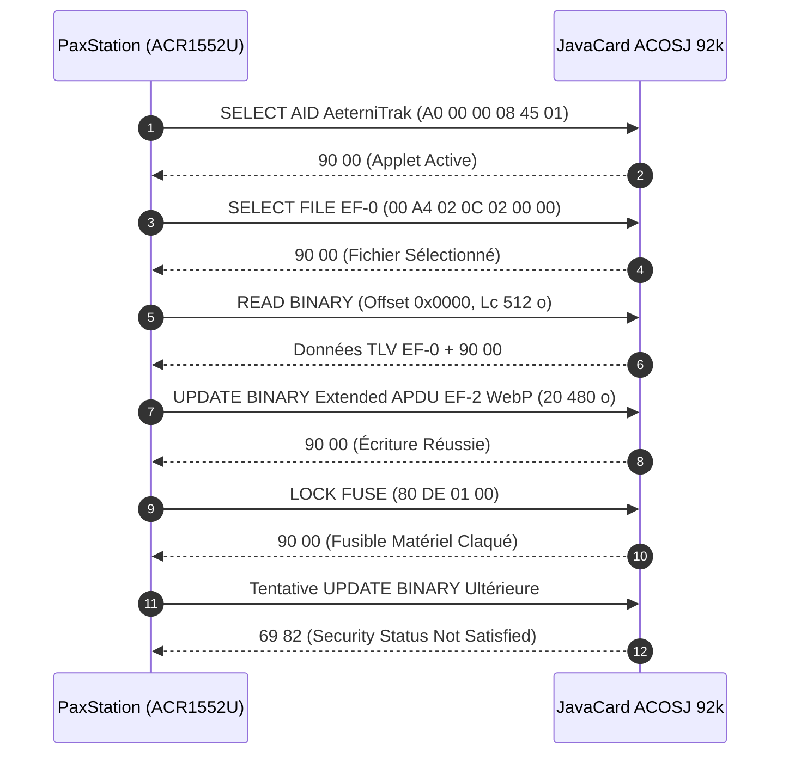
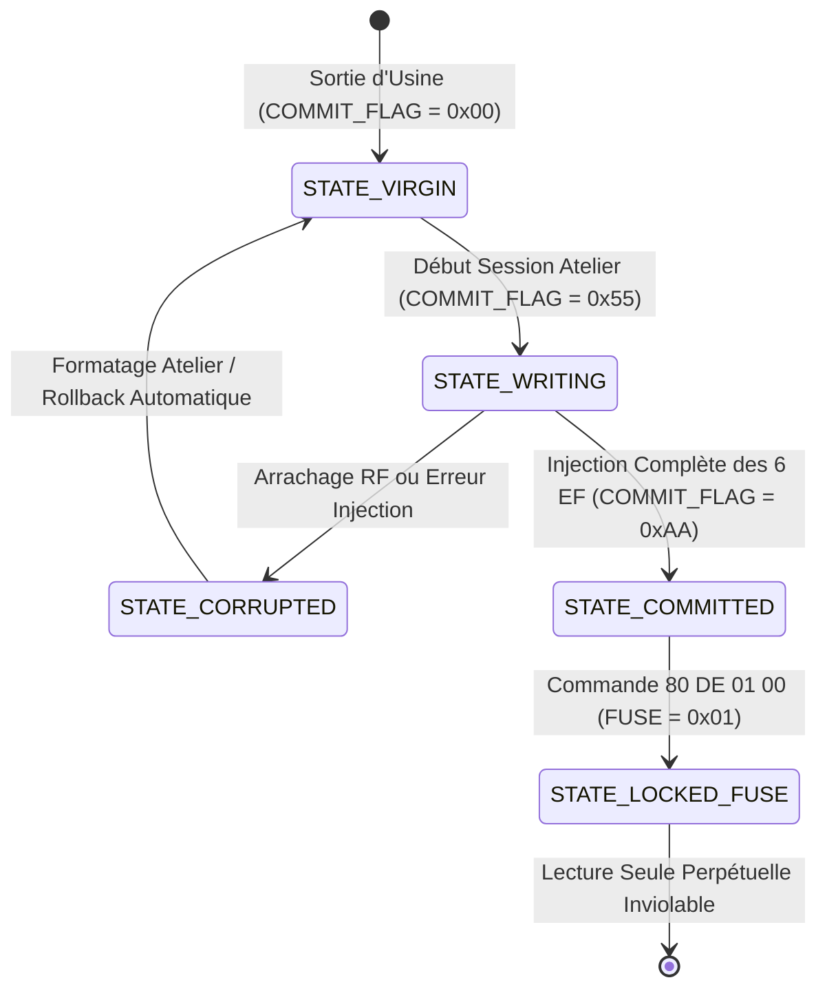

# Spécification Technique : Plan Mémoire Silicium ACOSJ 92 Ko, Partitionnement EF, APDU ISO 7816-4 & Persistance

> **Identifiant Normatif** : `AET-SPEC-STORAGE-001` (Jalon `STORAGE-001`)  
> **Auteurs** : Bushi 10 (Silicon Storage & Memory Budget) & Bushi 03 (Lead Android Hardware & NFC)  
> **Date de référence** : 5 octobre 2026  
> **Statut** : Spécification Normative de Référence — Approuvée  
> **Conformité Souveraine** :  
> - `DEC-AET-01` (ACOSJ 92 Ko exclusif, 92 160 octets — *« QUE DES CARTES 92Ko »*)  
> - `DEC-AET-04` (Agilité COSE_Sign1 ES256 & Ed25519)  
> - `DEC-AET-07` (Consultation mémorielle sous réserve, Option B bandeau ambré)  
> - `DEC-AET-08` (Architecture applicative quadripartite : PaxStudio, PaxStation, Sanctuaire, Filière)

---

## 1. Budget Silicium Inviolable ACOSJ 92 Ko (92 160 octets)

En vertu de la décision souveraine `DEC-AET-01` de Kudoro (*« QUE DES CARTES 92Ko »*), la cible matérielle unique retenue pour le déploiement du réseau *Le Pax Funèbre* est la puce cryptographique **JavaCard ACOSJ 92 Ko EEPROM** (norme ISO/IEC 7816-4 et ISO/IEC 14443-4 Type A).

L'intégralité des 92 160 octets de la mémoire non-volatile est allouée sans fragmentation à travers **6 Fichiers Élémentaires (Elementary Files - EF)** et une réserve d'usure matérielle strictement supérieure au seuil normatif de 5 % imposé par Bushi 10 :

### 1.1 Matrice Exhaustive de Partitionnement Silicium (`STORAGE-001`)

| Fichier | FID | Désignation Métier | Format & Norme | Taille Allouée (octets) | % Silicium | Droits d'Accès Pré-Scellement | Droits Post-Scellement (`LOCK_FUSE`) |
| :---: | :---: | :--- | :--- | :---: | :---: | :---: | :---: |
| **`EF-0`** | `0x0000` | **En-tête Silicium, UID & Flags** | TLV binaire propriétaire | **512 o** | 0,55 % | R/W (Admin Atelier) | **Lecture Seule Stricte** |
| **`EF-1`** | `0x0001` | **Profil Civil Mémoriel Canonique** | CBOR (RFC 8949 §4.2.1) | **2 048 o** (2 Ko) | 2,22 % | R/W (Admin Atelier) | **Lecture Seule Stricte (Dual-AID)** |
| **`EF-2`** | `0x0002` | **Portrait Visuel Éternel** | Image WebP (480×480 px) | **20 480 o** (20 Ko) | 22,22 % | R/W (Admin Atelier) | **Lecture Seule Stricte (IsoDep)** |
| **`EF-3`** | `0x0003` | **Mémo Vocal Inaltérable** | Audio Opus SILK (16 kHz mono) | **46 080 o** (45 Ko) | 50,00 % | R/W (Admin Atelier) | **Lecture Seule Stricte (IsoDep)** |
| **`EF-4`** | `0x0004` | **Registre Sépulture & Hommages** | CBOR compressé | **15 360 o** (15 Ko) | 16,67 % | R/W (Admin Atelier) | **Lecture Seule Stricte (IsoDep)** |
| **`EF-5`** | `0x0005` | **Enveloppe COSE_Sign1 Scellée** | COSE (RFC 9052 / RFC 9596) | **2 048 o** (2 Ko) | 2,22 % | R/W (Admin Atelier) | **Lecture Seule Stricte (Dual-AID)** |
| **RÉSERVE** | — | **Marge d'Usure & Table Système** | EEPROM Vierge / Wear-Leveling | **5 632 o** (~5,5 Ko) | 6,11 % | Réservé Microcontrôleur | **Inviolable (> 5% Garanti)** |
| **TOTAL** | — | **Capacité Totale ACOSJ 92 Ko** | — | **92 160 o** | **100,00 %** | — | — |

> [!IMPORTANT]
> **Règle d'Or Silicium (Bushi 10)** :  
> Le cumul des fichiers `EF-0` à `EF-5` représente exactement **86 528 octets** (93,89 % de la puce). La réserve résiduelle de **5 632 octets** (6,11 %) garantit la pérennité séculaire de l'EEPROM physique en permettant au contrôleur de gérer le nivellement d'usure (*wear leveling*) et le remplacement des cellules vieillissantes sans aucune altération des données mémorielles.

---

## 2. Structure Binaire TLV du Bloc d'En-Tête `EF-0` (512 octets)

Le fichier `EF-0` constitue le certificat de naissance physique de la carte AeterniTrak. Il est encodé sous forme de structures séquentielles **Tag-Length-Value (TLV)** binaires déterministes :

```
+-------------------------------------------------------------------------------+
|                       EN-TÊTE SILICIUM EF-0 (512 OCTETS)                      |
+-------------------------------------------------------------------------------+
| 0x00..0x03 : Magic Header "AET1" (4 octets : 0x41, 0x45, 0x54, 0x31)         |
| 0x04..0x07 : Tag 0x01 [Format Version] (Longueur 2 octets, ex: 0x01, 0x00)     |
| 0x08..0x13 : Tag 0x02 [Card UID Matériel] (Longueur 10 octets, ISO 14443-3)    |
| 0x14..0x1B : Tag 0x03 [Compteur Monotone Gravure] (Longueur 4 octets uint32)   |
| 0x1C..0x23 : Tag 0x04 [Horodatage Emission UTC] (Longueur 4 octets timestamp)  |
| 0x24..0x37 : Tag 0x05 [Empreinte Station PaxStation] (16 octets SHA-256 kid)   |
| 0x38..0x3C : Tag 0x06 [État Fusible Matériel LOCK] (1 octet : 0x00 ou 0x01)     |
| 0x3D..0x41 : Tag 0x07 [Drapeau Transaction COMMIT_FLAG] (1 octet : 0xAA)       |
| 0x42..0x5F : Tag 0x08 [Table Index Offsets EF-0..EF-5] (24 octets = 6 x 4 o)   |
| 0x60..0x1FF: Padding Défensif (Octets de bourrage 0xFF jusqu'à l'offset 512)   |
+-------------------------------------------------------------------------------+
```

### 2.1 Spécification Détaillée des Tags TLV de `EF-0`

| Tag (Hex) | Longueur (Lc) | Signification & Rôle Métier | Valeur Canonique / Format |
| :---: | :---: | :--- | :--- |
| `0x00` | 4 o | **Magic Number AeterniTrak** | `0x41 0x45 0x54 0x31` (ASCII `"AET1"`) obligatoire en tête |
| `0x01` | 2 o | **Version du Protocole Silicium** | `0x01 0x00` pour AeterniTrak V1.0 |
| `0x02` | 7 à 10 o | **Identifiant Unique Silicium (UID)** | UID matériel gravé en usine (anti-clonage) |
| `0x03` | 4 o | **Compteur Monotone d'Initialisations** | Entier non signé 32 bits Big-Endian incrémenté à chaque session atelier |
| `0x04` | 4 o | **Horodatage de Scellement UTC** | Timestamp POSIX uint32 (secondes depuis 1970) |
| `0x05` | 16 o | **Empreinte de la PaxStation Encodage** | Identifiant `kid` (16 octets) de la station professionnelle de gravure |
| `0x06` | 1 o | **État du Fusible Physique (`FUSE_STATUS`)** | `0x00` = Vierge/Atelier, `0x01` = Fusible claqué (Lecture Seule Perpétuelle) |
| `0x07` | 1 o | **Drapeau de Transaction Atomique (`COMMIT_FLAG`)** | `0x00` = Non initialisé, `0x55` = Écriture en cours, `0xAA` = Validé / Commit |
| `0x08` | 24 o | **Table des Offsets & Tailles des EF** | 6 entrées de 4 octets : `[FID_16][Size_16]` pour `EF-0` à `EF-5` |
| `0xFF` | Variable | **Bourrage d'Intégrité EEPROM** | Suites d'octets `0xFF` jusqu'à la limite stricte de 512 octets |

---

## 3. Table Exhaustive des Commandes APDU ISO/IEC 7816-4

Le dialogue de bas niveau entre l'application **PaxStation Encodage** (ou l'App native Android/iOS via IsoDep) et la carte ACOSJ 92 Ko s'effectue au moyen de commandes **APDU (Application Protocol Data Unit)** conformes à la norme internationale ISO/IEC 7816-4 :



### 3.1 Registre des Commandes APDU Supportées

| Commande Métier | CLA | INS | P1 | P2 | Lc / Le | Données Émises (Data In) / Réponses (Data Out) | Code Statut Succès |
| :--- | :---: | :---: | :---: | :---: | :---: | :--- | :---: |
| **SELECT AID AeterniTrak** | `0x00` | `0xA4` | `0x04` | `0x00` | `0x06` | `A0 00 00 08 45 01` (AID Applet AeterniTrak Core) | `90 00` |
| **SELECT AID NDEF Type 4** | `0x00` | `0xA4` | `0x04` | `0x00` | `0x07` | `D2 76 00 00 85 01 01` (NFC Forum Type 4 Tag v2.0) | `90 00` |
| **SELECT FILE (EF)** | `0x00` | `0xA4` | `0x02` | `0x0C` | `0x02` | `[FID_HI] [FID_LO]` (ex: `00 01` pour sélectionner `EF-1`) | `90 00` |
| **READ BINARY (Standard)** | `0x00` | `0xB0` | `Offset_HI` | `Offset_LO` | `Le` | Lecture de 1 à 256 octets (offset 15 bits, P1.b8 = 0) | `90 00` |
| **READ BINARY (Extended)** | `0x00` | `0xB0` | `Offset_HI` | `Offset_LO` | `00 Le1 Le2` | Lecture de blocs étendus jusqu'à 32 768 octets | `90 00` |
| **UPDATE BINARY (Standard)**| `0x00` | `0xD6` | `Offset_HI` | `Offset_LO` | `Lc` | Écriture de 1 à 255 octets (offset 15 bits dans P1-P2) | `90 00` |
| **UPDATE BINARY (Extended)**| `0x00` | `0xD6` | `Offset_HI` | `Offset_LO` | `00 Lc1 Lc2` | Écriture de blocs volumineux (WebP 20 Ko / Opus 45 Ko) | `90 00` |
| **GET CHALLENGE (Crypto)** | `0x00` | `0x84` | `0x00` | `0x00` | `0x10` | Génération on-chip d'un aléa matériel de 16 octets | `90 00` |
| **INTERNAL AUTHENTICATE**  | `0x00` | `0x88` | `0x00` | `0x00` | `0x20` | Signature ECDSA P-256 on-chip d'un défi (Option ES256) | `90 00` |
| **SET COMMIT FLAG**        | `0x80` | `0xDC` | `0x00` | `0xAA` | `0x00` | Validation atomique de l'intégrité de tous les EF | `90 00` |
| **LOCK FUSE (Fusible)**    | `0x80` | `0xDE` | `0x01` | `0x00` | `0x00` | Scellement matériel irréversible en Lecture Seule | `90 00` |

### 3.2 Gestion des Mots d'État (Status Words - SW1-SW2)

| SW1-SW2 | Signification Normative ISO 7816-4 | Diagnostic & Conduite à Tenir |
| :---: | :--- | :--- |
| `90 00` | **Success (Opération réussie)** | Poursuite nominale de la séquence opérationnelle. |
| `62 82` | **End of File reached before reading Le bytes** | Lecture tronquée : fin physique de l'EF atteinte. |
| `67 00` | **Wrong length (Lc ou Le invalide)** | Vérifier la longueur de trame dans la PaxStation. |
| `69 82` | **Security status not satisfied** | **Fusible claqué** : écriture interdite sur carte scellée. |
| `69 85` | **Conditions of use not satisfied** | Séquence non respectée (ex: UPDATE sans SELECT FILE préalable). |
| `6A 82` | **File not found** | Le FID demandé n'existe pas dans le DF AeterniTrak. |
| `6A 86` | **Incorrect parameters P1-P2** | Offset hors limites par rapport à la taille maximale de l'EF. |
| `6D 00` | **Instruction code not supported (INS invalide)** | Commande rejetée par l'applet JavaCard. |

---

## 4. Machine à États de Transaction Atomique & Résilience RF (`COMMIT_FLAG`)

La gravure sans contact (NFC 13.56 MHz) comporte un risque physique inhérent : **l'arrachage prématuré de la carte du champ électromagnétique** pendant l'injection des 78 Ko de données multimédia.

Pour éliminer tout risque de corruption partielle de la mémoire sans jamais bloquer définitivement une carte vierge, AeterniTrak implémente une **machine à états transactionnelle à double barrière** :



### 4.1 Définition des 4 États Normatifs

1. **`STATE_VIRGIN` (`COMMIT_FLAG = 0x00`, `FUSE = 0x00`)** :  
   Puce vierge de production. Les fichiers `EF-0` à `EF-5` sont créés mais non peuplés. L'Applet NDEF est désactivée.
2. **`STATE_WRITING` (`COMMIT_FLAG = 0x55`, `FUSE = 0x00`)** :  
   Dès la première commande `UPDATE BINARY`, l'applet positionne atomiquement le drapeau à `0x55`. Si le champ RF s'interrompt avant la fin, l'applet reste dans cet état. Au prochain contact, l'application PaxStation détecte `0x55`, refuse la remise du produit et impose une purge complète (Rollback) avant ré-écriture.
3. **`STATE_COMMITTED` (`COMMIT_FLAG = 0xAA`, `FUSE = 0x00`)** :  
   Tous les fichiers `EF-0` à `EF-5` ont été intégralement écrits et leurs empreintes SHA-256 validées. L'opérateur exécute `SET COMMIT FLAG (0xAA)`. La capsule mémorielle est intègre.
4. **`STATE_LOCKED_FUSE` (`COMMIT_FLAG = 0xAA`, `FUSE = 0x01`)** :  
   L'opérateur déclenche le scellement définitif via l'APDU `80 DE 01 00`. L'applet commute irréversiblement son registre interne en **Lecture Seule Matérielle** :
   - Toute commande ultérieure `UPDATE BINARY`, `WRITE BINARY` ou `ERASE` est rejetée avec l'erreur `69 82`.
   - L'Applet NDEF Type 4 Tag est activée avec son flag d'écriture fixé définitivement à `0xFF` (Read-Only).
   - Le scellement est physiquement éternel et inviolable.

---

## 5. Liaison Matérielle ACR1552U, Encapsulation CCID & Négociation PPS

La station professionnelle de gravure en agence funéraire utilise le lecteur de bureau haute performance **ACR1552U USB NFC Reader IV** (norme USB CCID v1.1).

### 5.1 Identification & Neutralisation Sonore

- **Vendor ID (VID)** : `0x072F` (Advanced Card Systems Ltd.)
- **Product ID (PID)** : `0x2200` (ACR1552U USB Contactless Reader)
- **Neutralisation Immédiate du Buzzer** :  
  Pour respecter la solennité et le silence du recueillement funéraire (Bushi 05 & Bushi 06), PaxStation désactive le buzzer matériel dès l'ouverture de la session WebUSB via l'échappement CCID propriétaire :
  ```
  Commande Échappement Buzzer OFF : FF 00 52 00 00
  ```

### 5.2 Négociation PPS de Vitesse Sans Contact (106 à 848 kbps)

L'ACR1552U et la JavaCard ACOSJ 92 Ko supportent la négociation de protocole et de vitesse **Protocol and Parameter Selection (PPS)** conforme à l'ISO/IEC 14443-4 §7.2 :

| Débit Négocié | Diviseur $D$ | Débit Données | Temps Gravure 78 Ko Brut | Temps Lecture Complète | Qualification Terrain |
| :---: | :---: | :---: | :---: | :---: | :--- |
| **106 kbps** | $D=1$ | 13,25 Ko/s | ~6,8 secondes | ~5,9 secondes | Débit universel de secours (Fallback RF) |
| **212 kbps** | $D=2$ | 26,50 Ko/s | ~3,5 secondes | ~2,9 secondes | Recommandé pour environnements RF bruités |
| **424 kbps** | $D=4$ | 53,00 Ko/s | ~1,8 seconde | ~1,4 seconde | **Vitesse Nominale Cible PaxStation** |
| **848 kbps** | $D=8$ | 106,00 Ko/s | **~0,9 seconde** | **~0,7 seconde** | Vitesse Ultra-Rapide (Contact direct antenne) |

> [!TIP]
> **Procédure de Négociation PPS Automatique (PaxStation)** :  
> À la réception de l'Answer to Select (ATS `3B 80 80 01 01`), PaxStation tente immédiatement d'établir la vitesse de **424 kbps** via la trame PPS `FF C0 00 [PPS0] [PPS1]`. Si le couplage inductif est optimal, le transfert des 78 Ko mémoriels (WebP + Opus) s'exécute en **moins de 2 secondes**.

---

## 6. Architecture Dual-Applet ACOSJ 92 Ko (IsoDep + NDEF Type 4 Tag)

Pour garantir l'interopérabilité universelle (`DEC-AET-09`) sans multiplier l'occupation mémoire :

```
+-------------------------------------------------------------------------------+
|                       JAVACARD ACOSJ 92 Ko (EEPROM PHYSIQUE)                  |
+-------------------------------------------------------------------------------+
|                                                                               |
|  [ APPLET 1 : NFC Forum Type 4 Tag ] AID: D2 76 00 00 85 01 01                |
|  - Accessible par Google Chrome (Web NFC) & iOS Background Tag Reading        |
|  - Capability Container (CC) File EF E103 (15 octets)                         |
|  - NDEF File EF E104 (Pointeur Virtuel SIO Zero-Copy)                        |
|                                                                               |
|  [ APPLET 2 : AeterniTrak Sovereign Core ] AID: A0 00 00 08 45 01             |
|  - Accessible par PaxStation (WebUSB/PC/SC) et App Native (IsoDep CoreNFC)   |
|  - Gestion des 6 fichiers élémentaires EF-0 à EF-5                            |
|                                                                               |
|  [ COUCHE SIO PARTAGÉE (Shareable Interface Object) ]                         |
|  EF E104 pointe directement sur la mémoire physique de :                      |
|  => EF-1 (Profil CBOR ≤ 1 900 o) + EF-5 (Enveloppe COSE_Sign1 ≤ 2 048 o)      |
|  => Zéro octet dupliqué dans l'EEPROM !                                       |
|                                                                               |
+-------------------------------------------------------------------------------+
```

1. **Applet 1 : NFC Forum Type 4 Tag (AID `D2760000850101`)**  
   - Conforme NFC Forum Type 4 Tag Operation v2.0.  
   - Contient le fichier Capability Container (`EF E103`, 15 octets).  
   - Le fichier NDEF (`EF E104`) contient l'enregistrement MIME officiel `application/aeternitrak-profile+cbor`.  
   - Ce fichier n'alloue **aucun octet physique d'EEPROM** : il implémente un pont mémoire partagé (Shareable Interface Object - SIO) pointant directement sur les plages mémoire des fichiers `EF-1` et `EF-5` de l'Applet 2.
2. **Applet 2 : AeterniTrak Sovereign Core (AID `A00000084501`)**  
   - Applet sécurisée propriétaire gérant les 6 Fichiers Élémentaires `EF-0` à `EF-5`.  
   - Capable d'exécuter des Extended APDUs jusqu'à 64 Ko par trame pour transférer les médias WebP et Opus à cadence maximale.  
   - Gère le drapeau transactionnel `COMMIT_FLAG` et la commande de verrouillage par fusible matériel `80 DE 01 00`.

---

## 7. Persistance Locale & Cache Sécurisé Sanctuaire (IndexedDB)

Sur les terminaux mobiles (navigateur Web Chrome sur Android ou application native iPhone/Android), les données lues sur le silicium physique sont mises en cache localement dans une base **IndexedDB** chiffrée :

- **Clé de dérivation matérielle** : Dérivée via Web Crypto API `PBKDF2` (100 000 itérations HMAC-SHA-256) ancrée sur le numéro de série matériel de la carte (`chip_uid` lu dans `EF-0`).
- **Chiffrement au repos** : `AES-GCM-256` avec vecteur d'initialisation aléatoire de 12 octets renouvelé à chaque écriture.
- **Règle de Souveraineté & Dignité** : Aucune donnée biométrique, portrait WebP ou mémo vocal n'est transmis à un serveur cloud sans consentement explicite et formel de la famille.
- **Pérennité Hors-Ligne** : L'application Sanctuaire B2C reste 100 % opérationnelle même au milieu d'un cimetière ou d'une forêt cinéraire dépourvue de toute couverture réseau 4G/5G.
