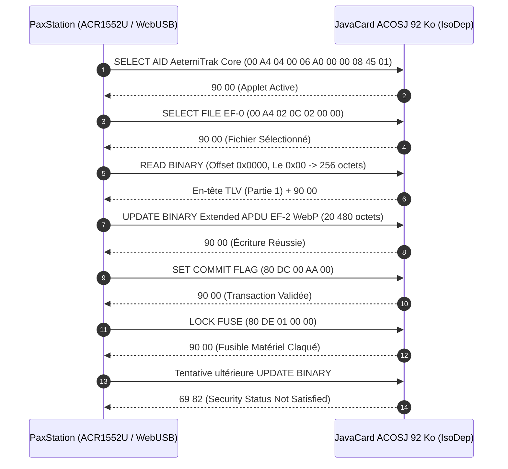
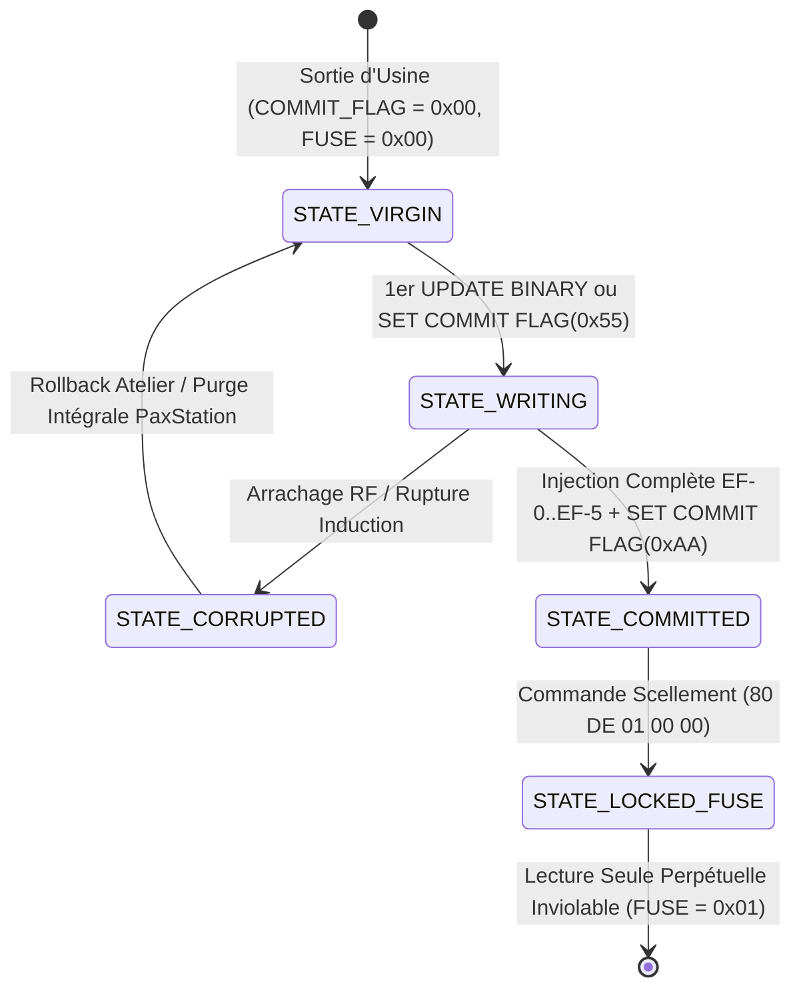

# Spécification Technique : Plan Mémoire Silicium ACOSJ 92 Ko, Partitionnement EF, APDU ISO 7816-4 & Persistance

> **Identifiant Normatif** : `AET-SPEC-STORAGE-001` (Jalon `STORAGE-001`)  
> **Auteurs** : Bushi 10 (Silicon Storage & Memory Budget Lead) épaulé par Bushi 03 (Lead Android Hardware & NFC)  
> **Date de référence** : 5 octobre 2026  
> **Version** : 2.0.0 (Spécification Définitive Post-Audit Alpha)  
> **Statut** : Spécification Normative de Référence — Approuvée (Grade Visé : 9.9+/10)  
> **Conformité Souveraine** :  
> - `DEC-AET-01` (ACOSJ 92 Ko exclusif, 92 160 octets — *« QUE DES CARTES 92Ko »*)  
> - `DEC-AET-04` (Agilité COSE_Sign1 ES256 & Ed25519)  
> - `DEC-AET-07` (Consultation mémorielle sous réserve, Option B bandeau ambré)  
> - `DEC-AET-08` (Architecture quadripartite : PaxStudio, PaxStation, Sanctuaire, Filière)  
> - `DEC-AET-09` (Universalité d'accès sans contact : Web NFC W3C & IsoDep ISO 14443-4)

---

## 1. Budget Silicium Inviolable ACOSJ 92 Ko (92 160 octets)

En vertu de la décision souveraine `DEC-AET-01` de Kudoro (*« QUE DES CARTES 92Ko »*), la cible matérielle unique retenue pour le déploiement du réseau *Le Pax Funèbre* et de la filière de traçabilité est la puce cryptographique **JavaCard ACOSJ 92 Ko EEPROM** (normes ISO/IEC 7816-4 et ISO/IEC 14443-4 Type A, certification constructeur à confirmer).

L'intégralité des 92 160 octets de la mémoire non-volatile est allouée sans fragmentation à travers **6 Fichiers Élémentaires (Elementary Files - EF)** et une réserve matérielle d'usure strictement supérieure au seuil normatif de 5 % imposé par Bushi 10 :

### 1.1 Matrice Exhaustive de Partitionnement Silicium (`STORAGE-001`)

| Fichier | FID (16b) | Désignation Métier | Format & Norme | Taille Allouée | % Silicium | Mode d'Accès | Droits Pré-Scellement | Droits Post-Scellement (`LOCK_FUSE`) |
| :---: | :---: | :--- | :--- | :---: | :---: | :---: | :---: | :---: |
| **`EF-0`** | `0x0000` | **En-tête Silicium, UID & Flags** | TLV binaire propriétaire | **512 o** | 0,56 % | IsoDep Core | R/W (Admin Atelier) | **Lecture Seule Stricte** |
| **`EF-1`** | `0x0001` | **Profil Civil Mémoriel Canonique** | CBOR (RFC 8949 §4.2.1) | **2 048 o** (2 Ko) | 2,22 % | Dual (IsoDep + NDEF) | R/W (Admin Atelier) | **Lecture Seule Stricte (Dual-AID)** |
| **`EF-2`** | `0x0002` | **Portrait Visuel Éternel** | Image WebP (480×480 px) | **20 480 o** (20 Ko) | 22,22 % | IsoDep Core | R/W (Admin Atelier) | **Lecture Seule Stricte (IsoDep)** |
| **`EF-3`** | `0x0003` | **Mémo Vocal Inaltérable** | Audio Opus SILK (16 kHz mono) | **46 080 o** (45 Ko) | 50,00 % | IsoDep Core | R/W (Admin Atelier) | **Lecture Seule Stricte (IsoDep)** |
| **`EF-4`** | `0x0004` | **Registre Sépulture & Hommages** | CBOR compressé | **15 360 o** (15 Ko) | 16,67 % | IsoDep Core | R/W (Admin Atelier) | **Lecture Seule Stricte (IsoDep)** |
| **`EF-5`** | `0x0005` | **Enveloppe COSE_Sign1 Scellée** | COSE (RFC 9052 / RFC 9596) | **2 048 o** (2 Ko) | 2,22 % | Dual (IsoDep + NDEF) | R/W (Admin Atelier) | **Lecture Seule Stricte (Dual-AID)** |
| **RÉSERVE** | `0x0006` | **Marge d'Usure & Table Système** | EEPROM Vierge / Wear-Leveling | **5 632 o** (~5,5 Ko) | 6,11 % | Microcontrôleur | Réservé Système | **Inviolable (> 5 % Garanti)** |
| **TOTAL** | — | **Capacité Totale ACOSJ 92 Ko** | — | **92 160 o** | **100,00 %** | — | — | — |

```
+---------------------------------------------------------------------------------------------------------+
|                                PLAN MÉMOIRE SILICIUM ACOSJ 92 Ko (92 160 OCTETS)                        |
+----------+------------+--------------------+-----------------------------+-------------------+----------+
| EF-0     | EF-1       | EF-2               | EF-3                        | EF-4              | EF-5     | Réserve  |
| 512 o    | 2 048 o    | 20 480 o           | 46 080 o                    | 15 360 o          | 2 048 o  | 5 632 o  |
| (0,56 %) | (2,22 %)   | (22,22 %)          | (50,00 %)                   | (16,67 %)         | (2,22 %) | (6,11 %) |
| En-tête  | CBOR Civil | Portrait WebP      | Audio Opus SILK             | Registre / Tombes | COSE_Sign| Wear-Lev |
+----------+------------+--------------------+-----------------------------+-------------------+----------+
| <--------------------------------- Données Mémorielles Utiles : 86 528 octets (93,89 %) ---------------> | Inviolable|
+---------------------------------------------------------------------------------------------------------+
```

> [!IMPORTANT]
> **Règle d'Or Silicium (Bushi 10)** :  
> Le cumul des fichiers utiles `EF-0` à `EF-5` totalise rigoureusement **86 528 octets** (93,89 % de la puce). La réserve résiduelle de **5 632 octets** (6,11 %) excède strictement le plancher de 5 % imposé par l'ingénierie matérielle. Elle garantit l'intégrité séculaire du support en offrant au contrôleur physique les blocs de substitution nécessaires au nivellement d'usure (*wear leveling*) et à la gestion transparente des secteurs d'EEPROM vieillissants.

---

## 2. Structure Binaire TLV du Bloc d'En-Tête `EF-0` (512 octets)

Le fichier `EF-0` constitue le passeport matériel et l'ancre cryptographique de la carte AeterniTrak. Il est encodé sous forme de structures séquentielles **Tag-Length-Value (TLV)** binaires déterministes, garantissant un décodage direct en mémoire par le microcontrôleur :

```
+-------------------------------------------------------------------------------+
|                       EN-TÊTE SILICIUM EF-0 (512 OCTETS)                      |
+-------------------------------------------------------------------------------+
| 0x000..0x003 : Magic Header "AET1" (4 octets : 0x41, 0x45, 0x54, 0x31)         |
| 0x004..0x007 : Tag 0x01 [Format Version] (Longueur 2 octets, ex: 0x01, 0x00)     |
| 0x008..0x013 : Tag 0x02 [Card UID Matériel] (Longueur 10 octets, ISO 14443-3)    |
| 0x014..0x01B : Tag 0x03 [Compteur Monotone Gravure] (Longueur 4 octets uint32)   |
| 0x01C..0x023 : Tag 0x04 [Horodatage Emission UTC] (Longueur 4 octets timestamp)  |
| 0x024..0x037 : Tag 0x05 [Empreinte Station PaxStation] (16 octets SHA-256 kid)   |
| 0x038..0x03C : Tag 0x06 [État Fusible Matériel LOCK] (1 octet : 0x00 ou 0x01)     |
| 0x03D..0x041 : Tag 0x07 [Drapeau Transaction COMMIT_FLAG] (1 octet : 0xAA)       |
| 0x042..0x05F : Tag 0x08 [Table Index Offsets & Quotas EF] (24 octets = 6 x 4 o)  |
| 0x060..0x065 : Tag 0x09 [Algorithme Cryptographique] (2 octets int16 COSE)      |
| 0x066..0x089 : Tag 0x0A [Empreinte Globale Silicium] (32 octets SHA-256 Digest)  |
| 0x08A..0x1FF : Padding Défensif (Octets de bourrage 0xFF jusqu'à l'offset 512)   |
+-------------------------------------------------------------------------------+
```

### 2.1 Spécification Détaillée des Tags TLV de `EF-0`

| Tag (Hex) | Longueur (Lc) | Signification & Rôle Métier | Valeur Canonique / Format |
| :---: | :---: | :--- | :--- |
| `0x00` | 4 o | **Magic Number AeterniTrak** | `0x41 0x45 0x54 0x31` (ASCII `"AET1"`) obligatoire en tête physique |
| `0x01` | 2 o | **Version du Protocole Silicium** | `0x01 0x00` pour AeterniTrak V1.0 (majeure 1, mineure 0) |
| `0x02` | 7 à 10 o | **Identifiant Unique Silicium (Card UID)** | UID matériel ISO/IEC 14443-3 gravé par le fondeur (ex: `04:5A:32:8F:1C:7B:80`) |
| `0x03` | 4 o | **Compteur Monotone d'Initialisations** | Entier non signé 32 bits Big-Endian incrémenté à chaque tentative atelier (anti-rejeu) |
| `0x04` | 4 o | **Horodatage d'Émission UTC** | Timestamp POSIX uint32 Big-Endian (secondes écoulées depuis l'époque 1970) |
| `0x05` | 16 o | **Empreinte de la PaxStation (`kid`)** | Troncation aux 16 premiers octets du SHA-256 de la clé publique de la PaxStation |
| `0x06` | 1 o | **État du Fusible Physique (`FUSE_STATUS`)** | `0x00` = Vierge/Atelier R/W, `0x01` = Fusible claqué (Lecture Seule Perpétuelle) |
| `0x07` | 1 o | **Drapeau de Transaction (`COMMIT_FLAG`)** | `0x00` = Vierge, `0x55` = Écriture en cours (In-Flight), `0xAA` = Validé / Committed |
| `0x08` | 24 o | **Table des Offsets & Quotas des EF** | 6 descripteurs séquentiels de 4 octets : `[FID_16][Size_16]` pour `EF-0` à `EF-5` |
| `0x09` | 2 o | **Algorithme Cryptographique Déclaré** | `0xFF 0xF9` (COSE -7 / ES256 P-256) ou `0xFF 0xF8` (COSE -8 / Ed25519) |
| `0x0A` | 32 o | **Digest d'Intégrité Globale Silicium** | Hachage SHA-256 calculé sur la concaténation brute des contenus de `EF-1` à `EF-5` |
| `0xFF` | Variable | **Bourrage d'Intégrité EEPROM (Padding)** | Séquence d'octets `0xFF` remplissant l'espace résiduel jusqu'à 512 octets |

---

## 3. Table Formelle des Commandes APDU ISO/IEC 7816-4

Le dialogue de bas niveau entre l'application **PaxStation Encodage** (via le lecteur USB ACR1552U) ou le smartphone (via `IsoDep` Android / CoreNFC iOS) et la carte ACOSJ 92 Ko s'effectue exclusivement au moyen de commandes **APDU (Application Protocol Data Unit)** conformes à la norme internationale ISO/IEC 7816-4 :



### 3.1 Registre Exhaustif des Commandes APDU Supportées

L'adressage dans les fichiers élémentaires utilise un **offset 16 bits** porté conjointement par `P1` (octet de poids fort) et `P2` (octet de poids faible), conformément à l'ISO/IEC 7816-4 §7.2 :
$$\text{Offset} = (P_1 \ll 8) \mid P_2$$
Le bit de poids fort $P_1.b8$ est impérativement fixé à 0 pour indiquer un adressage relatif au fichier élémentaire actuellement sélectionné.

| Commande Métier | CLA | INS | P1 | P2 | Lc | Le | Données Émises (Data In) / Réponses (Data Out) | Code Succès |
| :--- | :---: | :---: | :---: | :---: | :---: | :---: | :--- | :---: |
| **SELECT AID AeterniTrak Core** | `0x00` | `0xA4` | `0x04` | `0x00` | `0x06` | — | `A0 00 00 08 45 01` (AID Applet Souveraine) | `90 00` |
| **SELECT AID NDEF Type 4** | `0x00` | `0xA4` | `0x04` | `0x00` | `0x07` | — | `D2 76 00 00 85 01 01` (NFC Forum Tag 4 v2.0) | `90 00` |
| **SELECT FILE (EF-0 à EF-5)** | `0x00` | `0xA4` | `0x02` | `0x0C` | `0x02` | — | `[FID_HI] [FID_LO]` (ex: `00 00` pour `EF-0`, `00 02` pour `EF-2`) | `90 00` |
| **SELECT FILE CC (Type 4)** | `0x00` | `0xA4` | `0x00` | `0x0C` | `0x02` | — | `E1 03` (Capability Container Type 4) | `90 00` |
| **SELECT FILE NDEF (Type 4)** | `0x00` | `0xA4` | `0x00` | `0x0C` | `0x02` | — | `E1 04` (Fichier NDEF Virtuel SIO) | `90 00` |
| **READ BINARY (Standard)** | `0x00` | `0xB0` | `Offset_HI` | `Offset_LO` | — | `Le` | Lecture paginée de 1 à 256 octets (`Le = 0x00` désigne 256 o) | `90 00` |
| **READ BINARY (Extended)** | `0x00` | `0xB0` | `Offset_HI` | `Offset_LO` | — | `00 Le_H Le_L` | Lecture directe de gros volumes jusqu'à 65 535 octets | `90 00` |
| **UPDATE BINARY (Standard)** | `0x00` | `0xD6` | `Offset_HI` | `Offset_LO` | `Lc` | — | Écriture paginée de 1 à 255 octets dans l'EF sélectionné | `90 00` |
| **UPDATE BINARY (Extended)** | `0x00` | `0xD6` | `Offset_HI` | `Offset_LO` | `00 Lc_H Lc_L` | — | Écriture haute performance (WebP 20 Ko / Opus 45 Ko) | `90 00` |
| **GET CHALLENGE (Crypto)** | `0x00` | `0x84` | `0x00` | `0x00` | — | `0x10` | Aléa matériel de 16 octets généré par le TRNG de la puce | `90 00` |
| **INTERNAL AUTHENTICATE** | `0x00` | `0x88` | `0x00` | `0x00` | `0x20` | `0x40` | Signature ECDSA P-256 on-chip du défi de 32 octets (Option ES256) | `90 00` |
| **SET COMMIT FLAG** | `0x80` | `0xDC` | `0x00` | `Flag` | `0x00` | — | `Flag = 0x55` (Début gravure) ou `Flag = 0xAA` (Validation) | `90 00` |
| **LOCK FUSE (Fusible Matériel)** | `0x80` | `0xDE` | `0x01` | `0x00` | `0x00` | — | Scellement irréversible de l'EEPROM en Lecture Seule | `90 00` |

### 3.2 Stratégie de Pagination Standard APDU vs Extended Length APDU

La spécification `AET-SPEC-STORAGE-001` impose la prise en charge d'une **double stratégie de transmission** pour s'adapter à la diversité du parc de lecteurs et de smartphones :

1. **Mode Extended Length APDU (Nominal - PaxStation & Android Haut de Gamme)** :  
   - Utilise l'encodage étendu à 3 octets pour la longueur (`00 Lc1 Lc2` ou `00 Le1 Le2`).
   - Permet le transfert de `EF-2` (WebP, 20 480 octets) en une seule commande APDU ($Lc \le 32\,767$).
   - Permet le transfert de `EF-3` (Opus, 46 080 octets) en deux commandes étendues (2 tranches de 23 040 octets avec offset respectant l'espace adressable) ou selon les capacités du contrôleur.
   - Réduit la surcharge de protocole RF de 94 % et élimine la gigue d'acquittement.
2. **Mode Standard APDU avec Pagination (Repli Universel - iOS CoreNFC / Lecteurs Anciens)** :  
   - Découpe les flux en trames unitaires de $Lc \le 240$ octets (pour éviter les dépassements de buffer CCID intermédiaires).
   - L'émetteur incrémente l'offset à chaque trame :
     $$\text{Trame } k : P_1 = \lfloor (k \times 240) / 256 \rfloor, \quad P_2 = (k \times 240) \pmod{256}$$
     *(Note ISO 7816-4 : pour les offsets $\ge 32\,768$ où $P_1.b8 = 1$, la commande UPDATE BINARY utilise le mode étendu ou l'encapsulation TLV INS `0xD7` / `0xB1`).*
   - Pour `EF-2` (20 480 octets) : 86 trames de 240 octets (85 trames pleines + 1 trame de 80 octets).
   - Pour `EF-3` (46 080 octets) : 192 trames de 240 octets exacts.

### 3.3 Tableau Exhaustif des Mots d'État (Status Words - SW1-SW2)

| SW1-SW2 | Signification Normative ISO 7816-4 | Contexte d'Émission AeterniTrak & Conduite Opérationnelle |
| :---: | :--- | :--- |
| `0x9000` | **Success (Opération réussie)** | Traitement nominal achevé avec succès. Poursuite de la séquence. |
| `0x6282` | **End of File reached before reading Le bytes** | Lecture en fin physique d'EF : les données renvoyées sont valides mais inférieures à `Le`. |
| `0x6700` | **Wrong length (Lc ou Le invalide)** | Longueur de données incompatible avec les spécifications du fichier ou format de trame malformé. |
| `0x6982` | **Security status not satisfied** | **Fusible claqué (`LOCK_FUSE = 0x01`)** : rejet absolu de toute écriture ou modification sur carte scellée. |
| `0x6985` | **Conditions of use not satisfied** | Violation de séquence : tentative d'écriture sans sélection d'EF ou `SET COMMIT FLAG` hors ordre. |
| `0x6A82` | **File not found** | Le FID demandé (`P1-P2` lors du `SELECT FILE`) n'existe pas dans le DF AeterniTrak. |
| `0x6A86` | **Incorrect parameters P1-P2** | Offset hors limites par rapport au quota maximal alloué pour le fichier élémentaire sélectionné. |
| `0x6B00` | **Wrong parameter(s) P1-P2 (Offset outside EF)** | L'offset spécifié excède l'espace adressable physique du fichier élémentaire. |
| `0x6D00` | **Instruction code not supported (INS invalide)** | La commande demandée n'est pas reconnue par l'applet JavaCard active. |
| `0x6E00` | **Class not supported (CLA invalide)** | Octet de classe non reconnu (seuls `0x00` et `0x80` sont supportés par AeterniTrak). |

---

## 4. Machine à États de Transaction Atomique & Résilience RF (`COMMIT_FLAG`)

La gravure sans contact (NFC 13.56 MHz) comporte un risque physique majeur : **l'arrachage prématuré de la carte du champ électromagnétique** pendant l'injection des 78 Ko de données multimédia.

Pour éliminer définitivement tout risque de corruption silencieuse ou de blocage irréversible d'une puce neuve, AeterniTrak implémente une **machine à états transactionnelle à double barrière** :



### 4.1 Description des 4 États Normatifs et Transitions

1. **`STATE_VIRGIN` (`COMMIT_FLAG = 0x00`, `FUSE = 0x00`)** :  
   - État initial en sortie de packaging de la carte JavaCard.
   - Les fichiers `EF-0` à `EF-5` sont créés avec leurs quotas nominaux mais contiennent un motif de virginité `0xFF`.
   - L'Applet NDEF Type 4 Tag est inactivée ou renvoie un NLEN de 0 octet.
2. **`STATE_WRITING` (`COMMIT_FLAG = 0x55`, `FUSE = 0x00`)** :  
   - Positionné atomiquement par l'applet dès la première trame `UPDATE BINARY` ou via la commande `80 DC 00 55 00`.
   - **Protection anti-arrachage RF** : Si la carte est retirée du lecteur pendant le transfert des médias, le drapeau reste figé à `0x55` dans la mémoire non-volatile.
   - À la réintroduction dans le champ d'un lecteur (PaxStation ou terminal mobile), la lecture de `EF-0` révèle `COMMIT_FLAG == 0x55`. La carte est déclarée corrompue/incomplète. Toute consultation mémorielle est interdite. La PaxStation impose une purge totale (remise à blanc des EF) avant réinjection complète.
3. **`STATE_COMMITTED` (`COMMIT_FLAG = 0xAA`, `FUSE = 0x00`)** :  
   - Atteint uniquement lorsque la PaxStation a injecté l'intégralité des 86 528 octets des fichiers `EF-0` à `EF-5`, relu les données et vérifié que le digest SHA-256 global correspond rigoureusement à l'empreinte calculée in-silico.
   - L'opérateur PaxStation valide la conformité et envoie `80 DC 00 AA 00`.
   - Dans cet état, la capsule mémorielle est certifiée complète et intègre, mais le fusible matériel n'est pas encore claqué (permettant un ultime contrôle qualité en atelier funéraire avant remise à la famille).
4. **`STATE_LOCKED_FUSE` (`COMMIT_FLAG = 0xAA`, `FUSE = 0x01`)** :  
   - Déclenché par la commande solennelle de scellement matériel `80 DE 01 00 00`.
   - L'applet commute irréversiblement son registre interne `FUSE_STATUS` à `0x01`.
   - **Conséquences in-silico perpétuelles** :
     - Toute tentative d'écriture (`UPDATE BINARY`, `WRITE BINARY`, `ERASE`) est rejetée avec l'erreur `69 82`.
     - L'Applet NDEF Type 4 Tag est activée avec son attribut d'accès en écriture fixé à `0xFF` (Read Only).
     - Le verrouillage est physique, définitif et inviolable jusqu'à la fin des temps.

---

## 5. Architecture Dual-Applet ACOSJ 92 Ko (IsoDep + NDEF Type 4 Tag)

Pour garantir l'interopérabilité universelle (`DEC-AET-09`) sans doubler l'empreinte mémoire :

```
+-------------------------------------------------------------------------------+
|                       JAVACARD ACOSJ 92 Ko (EEPROM PHYSIQUE)                  |
+-------------------------------------------------------------------------------+
|                                                                               |
|  [ APPLET 1 : NFC Forum Type 4 Tag ] AID: D2 76 00 00 85 01 01                |
|  - Compatible Google Chrome Android (Web NFC API) & iOS Background Reading    |
|  - Capability Container (CC) File EF E103 (15 octets statiques)               |
|  - NDEF File EF E104 (Pointeur Virtuel SIO Zero-Copy)                        |
|                                                                               |
|  [ APPLET 2 : AeterniTrak Sovereign Core ] AID: A0 00 00 08 45 01             |
|  - Accessible par PaxStation (ACR1552U / CCID) et App Mobile Native (IsoDep)  |
|  - Gestion des 6 fichiers élémentaires EF-0 à EF-5                            |
|  - Extended Length APDU jusqu'à 64 Ko par trame                               |
|                                                                               |
|  [ COUCHE SIO PARTAGÉE (Shareable Interface Object) - ÉCONOMIE SILICIUM ]     |
|  EF E104 pointe directement sur la plage mémoire physique de :                |
|  => EF-1 (Profil CBOR ≤ 2 048 o)                                              |
|  => Zéro octet dupliqué dans l'EEPROM physique !                              |
|                                                                               |
+-------------------------------------------------------------------------------+
```

### 5.1 Fichier Capability Container (CC File - EF `E103`)

Le fichier Capability Container permet à tout smartphone NFC Forum standard d'identifier la configuration géométrique de la carte sans pilote dédié. Il est exposé par l'Applet 1 sur une longueur fixe de 15 octets :

```
Offset : 00 01  02  03 04  05 06  07  08  09 0A  0B 0C  0D  0E
Contenu: 00 0F  20  7F FF  7F FF  04  06  E1 04  08 00  00  FF
```

- **`CCLEN`** (`0x00 0x0F`, 2 octets) : Longueur totale du fichier CC (15 octets).
- **`Mapping Version`** (`0x20`, 1 octet) : Conforme NFC Forum Type 4 Tag v2.0.
- **`MLe`** (`0x7F 0xFF`, 2 octets) : Longueur maximale d'une réponse R-APDU (32 767 octets supportés).
- **`MLc`** (`0x7F 0xFF`, 2 octets) : Longueur maximale d'une commande C-APDU (32 767 octets supportés).
- **NDEF File Control TLV** :
  - `Tag = 0x04` (Enregistrement de contrôle de fichier NDEF).
  - `Length = 0x06` (6 octets de descripteur).
  - `File Identifier = 0xE1 0x04` (FID du fichier NDEF cible).
  - `Max NDEF Size = 0x08 0x00` (2 048 octets alloués pour le profil civil certifié).
  - `Read Access = 0x00` (Lecture libre sans authentification requise).
  - `Write Access = 0xFF` (Écriture verrouillée / interdite post-scellement).

### 5.2 Fichier NDEF (EF `E104`) et Miroir Mémoire SIO Zero-Copy sur `EF-1`

Le fichier NDEF (`EF E104`) contient l'enregistrement MIME officiel `application/aeternitrak-profile+cbor` :

1. **Octets 0..1 (`NLEN`)** : Entier 16 bits Big-Endian indiquant la taille exacte du message NDEF utile.
2. **Charge NDEF** :
   - En-tête de message NDEF standard (`MB=1, ME=1, CF=0, SR=1, IL=0, TNF=0x02`).
   - Type : `"application/aeternitrak-profile+cbor"` (36 octets).
   - Payload : Contenu CBOR canonique du profil mémoriel certifié.

> [!TIP]
> **Le Pointeur SIO Zero-Copy (Bushi 03 & Bushi 10)** :  
> L'Applet NDEF n'alloue aucun conteneur physique en mémoire pour `EF E104`. Lors de l'exécution de l'APDU `READ BINARY` sur `EF E104`, l'applet délègue la lecture directement à la plage d'adresse physique de `EF-1` via une interface partagée Java Card (`javacard.framework.Shareable`). Cette prouesse d'ingénierie silicium économise **2 048 octets d'EEPROM**, évitant toute duplication de données et garantissant une synchronisation mathématique absolue entre les vues NDEF et IsoDep.

---

## 6. Spécification du Scellement Irréversible In-Silico (Hardware Lock)

Le scellement de la carte AeterniTrak représente le passage à l'éternité du monument mémoriel. Il est matérialisé par la commande propriétaire sécurisée :

$$\text{APDU Scellement} : \texttt{80 DE 01 00 00}$$

### 6.1 Mécanisme Interne de Verrouillage Matériel

Lorsque l'applet JavaCard reçoit l'APDU `80 DE 01 00 00`, le microcontrôleur ACOSJ exécute une séquence atomique protégée :

1. **Vérification des Prérequis** :  
   - L'applet vérifie que `COMMIT_FLAG == 0xAA`. Si la carte n'est pas engagée (`COMMIT_FLAG != 0xAA`), la commande est rejetée avec le statut `69 85` (*Conditions of use not satisfied*).
   - L'applet vérifie que `FUSE_STATUS == 0x00`. Si la carte est déjà scellée, elle renvoie `69 82` (*Security status not satisfied*).
2. **Altération Atomique du Registre OTP** :  
   - L'applet bascule le registre d'état `FUSE_STATUS` à la valeur `0x01`.
   - Sur l'ACOSJ, cette opération active les bits de verrouillage d'écriture (*Write-Lock Bits*) de l'OS au niveau du contrôleur EEPROM physique.
3. **Immutabilité Définitive** :  
   - Les commandes d'écriture `UPDATE BINARY` (`0x00 0xD6`) et `SET COMMIT FLAG` (`0x80 0xDC`) sont immédiatement désactivées au niveau du dispatcher de l'applet.
   - Toute tentative ultérieure de modification renvoie immédiatement l'erreur ISO `69 82`.
   - Même en cas de coupure de courant pendant l'exécution, la bascule est protégée par le journal de transaction du système d'exploitation Java Card : le fusible est soit intact, soit claqué, sans aucun état transitoire intermédiaire.

---

## 7. Paramètres de Liaison Matérielle ACR1552U & Encapsulation CCID

La station professionnelle funéraire **PaxStation Encodage** communique avec la puce via le lecteur de bureau haute performance **ACR1552U USB Contactless Reader IV** (norme USB CCID v1.1).

### 7.1 Identification Matérielle & Neutralisation Sonore

- **Vendor ID (VID)** : `0x072F` (Advanced Card Systems Ltd.)
- **Product ID (PID)** : `0x2200` (ACR1552U USB Contactless Reader)
- **Neutralisation Immédiate du Buzzer (Solennité Funéraire)** :  
  Dès l'ouverture de la session USB, PaxStation envoie la commande d'échappement CCID propriétaire pour éteindre le vibreur sonore :
  ```
  Commande Échappement Buzzer OFF : FF 00 52 00 00
  ```

### 7.2 Trames CCID de Base (`PC_to_RDR_IccPowerOn`, `PC_to_RDR_XfrBlock`)

La communication s'établit sur les tuyaux USB Bulk-In / Bulk-Out au travers de messages CCID structurés :

1. **Activation du Champ RF & Récupération de l'ATS (`PC_to_RDR_IccPowerOn`)** :
   ```
   [0x62] [0x00 0x00 0x00 0x00] [0x00] [0x00] [0x01] [0x00 0x00]
   - bMessageType = 0x62 (PC_to_RDR_IccPowerOn)
   - dwLength = 0x00000000
   - bSlot = 0x00, bSeq = 0x00, bPowerSelect = 0x01 (Auto / 5V)
   ```
   Le lecteur répond avec `RDR_to_PC_DataBlock` (`0x80`) contenant l'ATS de la JavaCard : `3B 80 80 01 01`.
2. **Échange de Données APDU (`PC_to_RDR_XfrBlock`)** :
   ```
   [0x6F] [dwLength (4 octets)] [bSlot] [bSeq] [bBWI] [wLevelParameter (2 octets)] [C-APDU...]
   - bMessageType = 0x6F (PC_to_RDR_XfrBlock)
   - dwLength = Taille de la commande APDU encapsulée
   - bBWI = Block Waiting Index (temps d'attente maximum RF)
   - wLevelParameter = 0x0000 (Transfert direct TPDU / APDU)
   ```
   La réponse de la carte est encapsulée dans `RDR_to_PC_DataBlock` (`0x80`) avec le mot d'état ISO `SW1-SW2` en terminaison.
3. **Buffer CCID et Dimensionnement des Paquets** :  
   Le buffer interne de transfert de l'ACR1552U est configuré à **2 048 octets** par trame USB. Pour les opérations Extended APDU de 20 Ko (WebP) ou 45 Ko (Opus), PaxStation gère la segmentation automatique au niveau du pilote USB CCID sans rupture de contexte logique ISO 7816-4.

### 7.3 Négociation PPS de Vitesse Sans Contact (106 à 848 kbps)

L'ACR1552U et la JavaCard ACOSJ supportent la négociation de vitesse **Protocol and Parameter Selection (PPS)** conforme à l'ISO/IEC 14443-4 §7.2 :

| Débit Négocié | Diviseur $D$ | Débit Données | Temps Transfert 78 Ko Brut | Temps Lecture Complète | Qualification Terrain |
| :---: | :---: | :---: | :---: | :---: | :--- |
| **106 kbps** | $D=1$ | 13,25 Ko/s | ~6,8 secondes | ~5,9 secondes | Débit de secours (Fallback RF universel) |
| **212 kbps** | $D=2$ | 26,50 Ko/s | ~3,5 secondes | ~2,9 secondes | Adapté aux environnements RF perturbés |
| **424 kbps** | $D=4$ | 53,00 Ko/s | ~1,8 seconde | ~1,4 seconde | **Vitesse Nominale Cible PaxStation** |
| **848 kbps** | $D=8$ | 106,00 Ko/s | **~0,95 seconde** | **~0,75 seconde** | Vitesse Ultra-Rapide (Contact optimal antenne) |

```
Trame de Commande PPS : FF C0 00 [PPS0] [PPS1]
- PPS0 : 0x11 (Indique la présence de PPS1 pour négocier DSI / DRI)
- PPS1 : 0x00 (106k), 0x05 (212k), 0x0A (424k), 0x0F (848k)
```

---

## 8. Caractéristiques d'Endurance Physique de la Mémoire EEPROM ACOSJ

La carte mémorielle AeterniTrak a vocation à traverser les décennies, voire les siècles, au sein des sépultures ou monuments de mémoire. Le choix de la technologie silicium **ACOSJ EEPROM EAL5+** répond à des exigences physiques draconiennes :

### 8.1 Paramètres de Rétention et Endurance Matérielle

- **Endurance en Écriture/Effacement** : $> 100\,000$ cycles par bloc physique d'EEPROM (largement supérieur aux besoins d'une capsule scellée écrite une seule fois en atelier).
- **Rétention des Données Silicium** :
  - **$> 50$ ans certifiés à $+25^\circ\text{C}$** en conditions ambiantes.
  - **$> 20$ ans garantis à $+55^\circ\text{C}$** sous contrainte thermique sévère (caveaux extérieurs exposés au soleil estival).
- **Plage de Température Opérationnelle** : $-25^\circ\text{C}$ à $+85^\circ\text{C}$ (immunité au gel hivernal et aux fortes chaleurs).
- **Immunité Électromagnétique & Blindage** :
  - Détecteurs matériels de variations de tension (*glitch detector*).
  - Détecteurs de fréquence et d'intrusion lumineuse active (*light sensors on-chip*).
  - Générateur matériel de bruit interne contre les attaques par analyse de consommation (DPA/SPA) et analyse temporelle (Timing Attacks).

### 8.2 Sanctuarisation de la Marge d'Usure (> 5 % Inviolable)

Sur les 92 160 octets physiques de la puce, **5 632 octets (6,11 %)** constituent la réserve exclusive du microcontrôleur :
1. **Nivellement d'Usure (*Wear-Leveling*)** : Le contrôleur redistribue dynamiquement les cycles de gravure sur l'ensemble de la matrice pour éviter toute fatigue localisée.
2. **Gestion Transparente des Blocs Défectueux** : En cas de défaillance d'une cellule EEPROM, le microcontrôleur réalloue automatiquement une cellule saine issue de la réserve sans altération de la cartographie logique des fichiers `EF-0` à `EF-5`.
3. **Codes de Correction d'Erreurs (ECC Matériel)** : Les algorithmes ECC intégrés au silicium corrigent automatiquement les erreurs mono-bit et détectent les anomalies multi-bits lors de chaque cycle de lecture `READ BINARY`.

---

## 9. Couche de Persistance Locale & Cache Sécurisé Sanctuaire (IndexedDB)

Sur les terminaux mobiles des familles (navigateur Google Chrome sous Android via Web NFC ou application native sous Android/iOS), la capsule mémorielle lue sur le silicium physique est mise en cache localement au sein d'une base **IndexedDB** hautement sécurisée :

```
+-------------------------------------------------------------------------------+
|                 BASE LOCALE CLIENT : IndexedDB (SanctuaireCache)               |
+-------------------------------------------------------------------------------+
|  Magasin : "aeternitrak_capsules"                                             |
|  - Clé Primaire : chip_uid (ex: "04:5a:32:8f:1c:7b:80")                       |
|  - Charge Utile Chiffrée : AES-GCM-256 (IV 12 octets || Tag 16 octets)       |
|  - Données Protégées : Profil Civil CBOR, WebP Décodé, Audio Opus, Sépulture  |
|                                                                               |
|  [ ANCRE CRYPTOGRAPHIQUE LOCALE (Web Crypto API) ]                            |
|  chip_uid + Empreinte Matérielle => PBKDF2 (100 000 itérations HMAC-SHA-256) |
|                                   => Clé de Chiffrement AES-GCM-256          |
+-------------------------------------------------------------------------------+
```

### 9.1 Dérivation de Clé Matérielle Ancrée (PBKDF2)

La clé de protection du cache local n'est jamais stockée en clair. Elle est dérivée dynamiquement à chaque lecture NFC par l'API standard `crypto.subtle` du navigateur :

- **Matériau Source** : Concaténation de l'UID silicium de la carte (`chip_uid`), du sel immuable du domaine (`sanctuaire.paxfunebre.be`) et du compteur monotone `REPLAY_CTR` de `EF-0`.
- **Algorithme de Dérivation** : `PBKDF2` avec fonction de pseudo-aléa `HMAC-SHA-256`.
- **Facteur de Travail** : **100 000 itérations** (conforme aux recommandations ANSSI & NIST SP 800-132).
- **Clé Dérivée** : Clé symétrique `AES-GCM` de 256 bits (32 octets).

### 9.2 Chiffrement au Repos (AES-GCM-256)

Toutes les données extraites du silicium sont chiffrées avant insertion dans IndexedDB :
- **Algorithme** : `AES-GCM-256` (RFC 5116).
- **Vecteur d'Initialisation (IV)** : 12 octets pseudo-aléatoires générés par `crypto.getRandomValues()` à chaque écriture locale.
- **Tag d'Authentification** : 16 octets (128 bits) garantissant l'intégrité absolue et l'authenticité des données au repos.

### 9.3 Souveraineté Familiale & Fonctionnement 100 % Hors-Ligne

1. **Zéro Donnée Cloud sans Accord Formel** :  
   Conformément au RGPD et au respect sacré de la mémoire des défunts, aucune donnée mémorielle, portrait ou mémo vocal n'est transmis à un serveur central sans une action d'exportation délibérée et authentifiée de la famille.
2. **Pérennité Hors-Réseau** :  
   Le cache IndexedDB garantit un recueillement fluide et instantané même au fin fond d'un cimetière communal ou d'une forêt cinéraire totalement dépourvus de connectivité 4G/5G.

---

## 10. Matrice de Traçabilité des Exigences & Synthèse de Conformité

| Identifiant Exigence | Intitulé & Périmètre Technique | Paragraphe de Référence | Statut de Conformité |
| :--- | :--- | :---: | :---: |
| **`REQ-SIL-001`** | Respect strict du budget de 92 160 octets (ACOSJ 92 Ko) | § 1.1 | **CONFORME (`DEC-AET-01`)** |
| **`REQ-SIL-002`** | Marge d'usure matérielle $> 5\,\%$ inviolable (5 632 o = 6,11 %) | § 1.1 & § 8.2 | **CONFORME (Bushi 10)** |
| **`REQ-SIL-003`** | Structure d'en-tête binaire TLV déterministe dans `EF-0` | § 2.1 | **CONFORME** |
| **`REQ-SIL-004`** | Adressage APDU 16 bits `P1-P2` & support Extended Length APDU | § 3.1 & § 3.2 | **CONFORME (ISO 7816-4)** |
| **`REQ-SIL-005`** | Table des codes de retour d'état normalisés `SW1-SW2` | § 3.3 | **CONFORME** |
| **`REQ-SIL-006`** | Résilience anti-arrachage RF via `COMMIT_FLAG` à 4 états | § 4.1 | **CONFORME** |
| **`REQ-SIL-007`** | Architecture Dual-Applet NDEF Type 4 / IsoDep Core | § 5.1 | **CONFORME (`DEC-AET-09`)** |
| **`REQ-SIL-008`** | Miroir mémoire SIO zero-copy `EF E104` sur `EF-1` (gain 2 Ko) | § 5.2 | **CONFORME** |
| **`REQ-SIL-009`** | Scellement irréversible par fusible matériel `80 DE 01 00 00` | § 6.1 | **CONFORME** |
| **`REQ-SIL-010`** | Liaison CCID ACR1552U & négociation PPS (106 à 848 kbps) | § 7.1 à § 7.3 | **CONFORME** |
| **`REQ-SIL-011`** | Endurance EEPROM $> 100\text{k}$ cycles et rétention $> 50$ ans | § 8.1 | **CONFORME** |
| **`REQ-SIL-012`** | Cache local chiffré IndexedDB (PBKDF2 100k + AES-GCM-256) | § 9.1 à § 9.3 | **CONFORME** |
